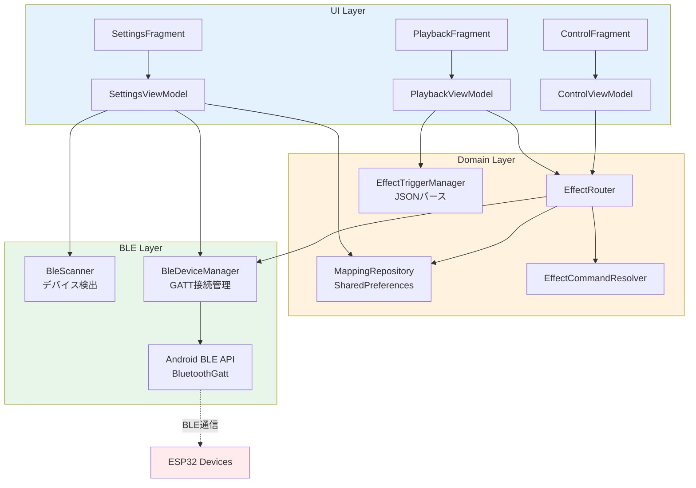
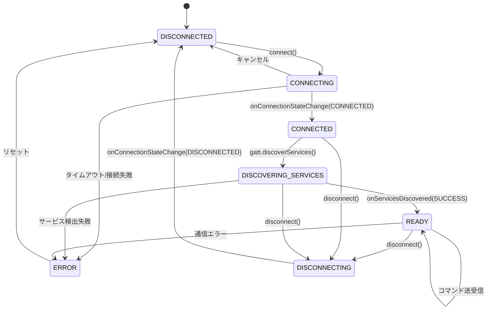
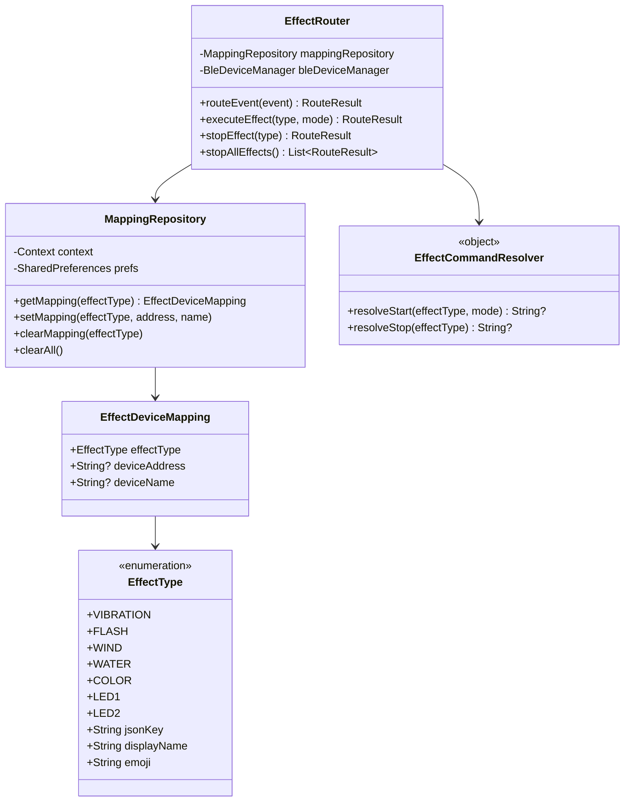
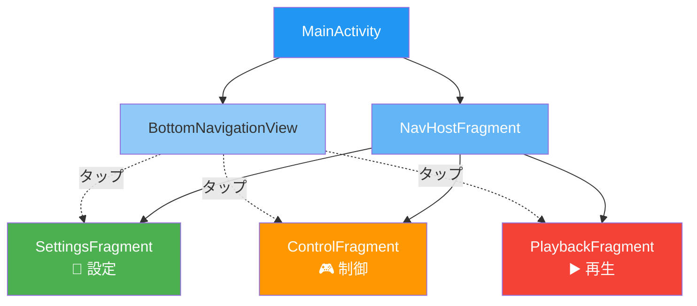
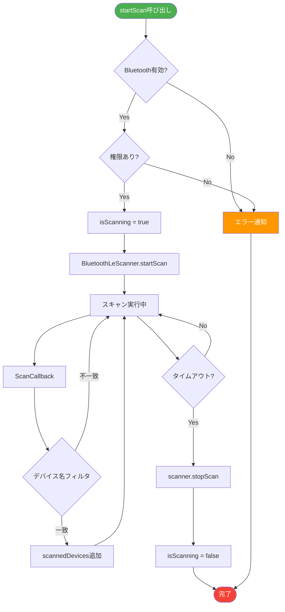
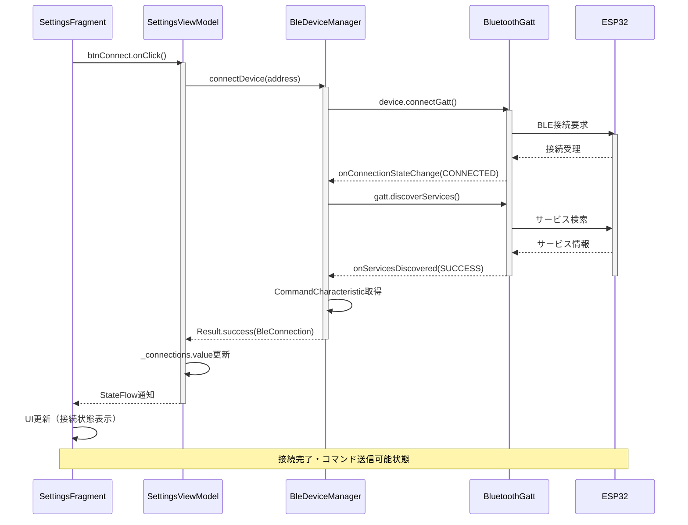
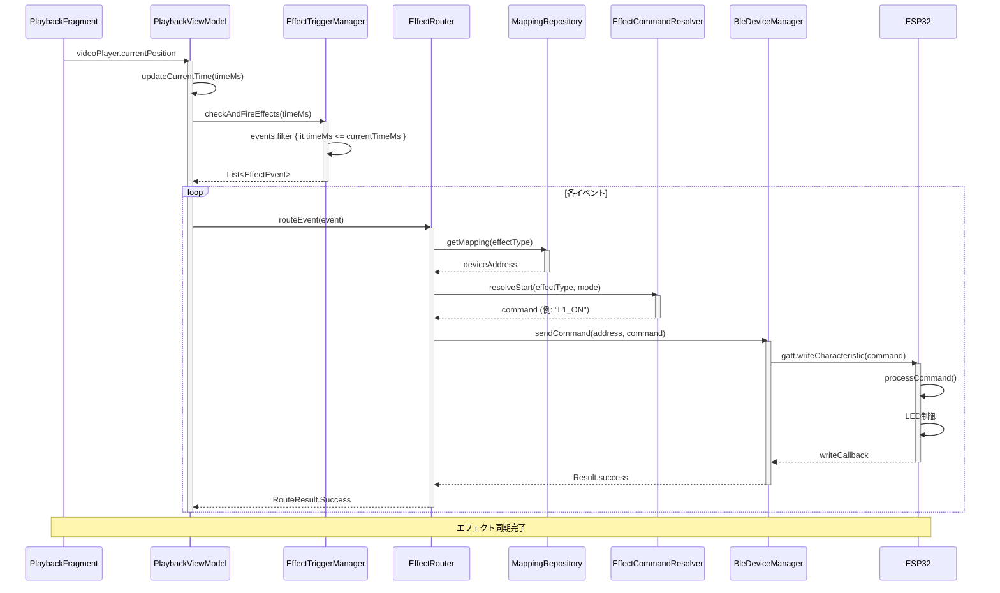
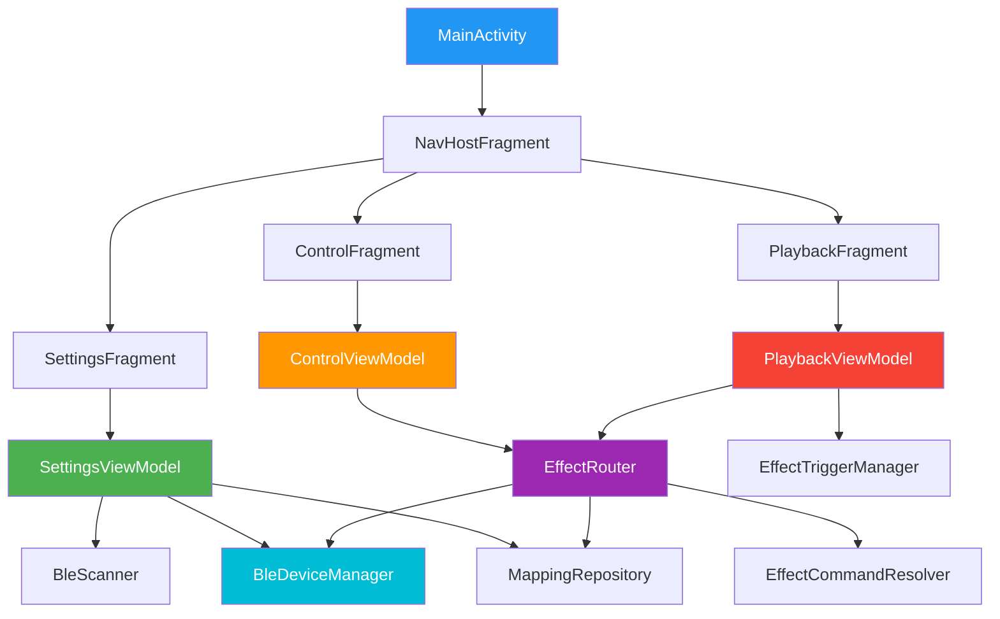

# Android アプリケーション詳細仕様書

**バージョン**: 1.0.0  
**作成日**: 2026年1月30日  
**対象プロジェクト**: bluetooth_test  

---

## 目次

1. [概要](#1-概要)
2. [アプリケーション構成](#2-アプリケーション構成)
3. [アーキテクチャ](#3-アーキテクチャ)
4. [パッケージ構成](#4-パッケージ構成)
5. [画面仕様](#5-画面仕様)
6. [クラス詳細仕様](#6-クラス詳細仕様)
7. [データフロー](#7-データフロー)
8. [依存関係](#8-依存関係)
9. [ビルド設定](#9-ビルド設定)
10. [権限設定](#10-権限設定)

---

## 1. 概要

### 1.1 アプリケーション概要

本アプリケーションは、Android端末からBluetooth Low Energy (BLE) を使用して複数のESP32デバイスに接続し、動画再生に同期したエフェクト制御（LED点灯/点滅など）を実現するシステムである。

### 1.2 主要機能

| 機能 | 説明 |
|:-----|:-----|
| **BLEデバイススキャン** | 4Dデバイス（4D_LED1_XXXX, 4D_LED2_XXXX）を自動検出 |
| **複数デバイス接続** | 最大7台のESP32に同時接続（BLE仕様上限） |
| **エフェクトマッピング** | エフェクトタイプとデバイスの割り当て管理 |
| **手動LED制御** | LED1/LED2の点灯・消灯・点滅の手動操作 |
| **動画再生同期** | JSONタイムラインに基づいた自動エフェクト発火 |
| **通信ログ表示** | 送信コマンドのリアルタイムログ表示 |

### 1.3 技術スタック

| 項目 | 技術/バージョン |
|:-----|:----------------|
| **言語** | Kotlin 2.0.21 |
| **最小SDK** | Android 8.0 (API 26) |
| **ターゲットSDK** | Android 14 (API 36) |
| **UIフレームワーク** | View Binding + Navigation Component |
| **非同期処理** | Kotlin Coroutines 1.7.3 |
| **状態管理** | StateFlow / SharedFlow |
| **アーキテクチャ** | MVVM + Repository パターン |

---

## 2. アプリケーション構成

### 2.1 パッケージ情報

```
applicationId: com.example.bluetooth_test
versionCode: 1
versionName: 1.0
```

### 2.2 ディレクトリ構造

```
app/src/main/
├── java/com/example/bluetooth_test/
│   ├── MainActivity.kt                    # メインアクティビティ
│   ├── BluetoothService.kt                # Bluetooth Classic (レガシー)
│   ├── TriggerManager.kt                  # トリガー管理 (レガシー)
│   ├── VideoSyncManager.kt                # 動画同期マネージャー
│   ├── ble/                               # BLE通信レイヤー
│   │   ├── BleConstants.kt                # BLE定数定義
│   │   ├── BleConnection.kt               # 接続状態データクラス
│   │   ├── BleDeviceManager.kt            # デバイス接続管理
│   │   └── BleScanner.kt                  # BLEスキャナー
│   ├── effect/                            # エフェクト定義
│   │   ├── EffectType.kt                  # エフェクトタイプ列挙型
│   │   ├── EffectEvent.kt                 # エフェクトイベント
│   │   ├── EffectCommandResolver.kt       # コマンド解決
│   │   └── EffectTriggerManager.kt        # トリガー管理
│   ├── mapping/                           # デバイスマッピング
│   │   ├── EffectDeviceMapping.kt         # マッピングデータ
│   │   ├── EffectRouter.kt                # ルーティングエンジン
│   │   └── MappingRepository.kt           # マッピング永続化
│   └── ui/                                # UI層
│       ├── SharedViewModel.kt             # 共有ViewModel
│       ├── control/                       # 制御画面
│       │   ├── ControlFragment.kt
│       │   └── ControlViewModel.kt
│       ├── playback/                      # 再生画面
│       │   ├── PlaybackFragment.kt
│       │   └── PlaybackViewModel.kt
│       └── settings/                      # 設定画面
│           ├── SettingsFragment.kt
│           ├── SettingsViewModel.kt
│           ├── DeviceListAdapter.kt
│           └── MappingListAdapter.kt
├── res/
│   ├── layout/                            # レイアウトXML
│   │   ├── activity_main.xml
│   │   ├── fragment_settings.xml
│   │   ├── fragment_control.xml
│   │   ├── fragment_playback.xml
│   │   ├── item_device.xml
│   │   └── item_mapping.xml
│   ├── navigation/
│   │   └── nav_graph.xml                  # ナビゲーショングラフ
│   └── menu/
│       └── bottom_navigation.xml          # ボトムナビメニュー
└── assets/
    ├── demo1.json                         # LEDデモ用タイムライン
    └── 4dx_demo.json                      # 4DXデモ用タイムライン
```

---

## 3. アーキテクチャ

### 3.1 全体構成図



### 3.2 レイヤー責務

| レイヤー | 責務 | 主要クラス |
|:---------|:-----|:-----------|
| **UI Layer** | ユーザー操作の受付、状態の表示 | Fragment, Adapter |
| **ViewModel Layer** | UIロジック、状態管理 | ViewModel, StateFlow |
| **Domain Layer** | ビジネスロジック、ルーティング | EffectRouter, Repository |
| **BLE Layer** | BLE通信の抽象化 | BleDeviceManager, BleScanner |

---

## 4. パッケージ構成

### 4.1 `ble` パッケージ

BLE通信に関するすべてのクラスを格納。

#### 4.1.1 BleConstants.kt

```kotlin
object BleConstants {
    // Service/Characteristic UUIDs
    val SERVICE_UUID: UUID = UUID.fromString("4D580001-0000-1000-8000-00805F9B34FB")
    val COMMAND_CHAR_UUID: UUID = UUID.fromString("4D580002-0000-1000-8000-00805F9B34FB")
    val STATUS_CHAR_UUID: UUID = UUID.fromString("4D580003-0000-1000-8000-00805F9B34FB")
    val CCCD_UUID: UUID = UUID.fromString("00002902-0000-1000-8000-00805f9b34fb")
    
    // デバイス名パターン
    val DEVICE_NAME_PATTERN = Regex("4D_(Device|LED1|LED2)_[0-9A-Fa-f]{4}")
    
    // タイムアウト設定
    const val CONNECTION_TIMEOUT_MS = 10_000L
    const val SCAN_TIMEOUT_MS = 15_000L
    const val WRITE_TIMEOUT_MS = 5_000L
    const val GATT_OPERATION_DELAY_MS = 100L
    
    // 再接続設定
    const val MAX_RECONNECT_ATTEMPTS = 3
    const val RECONNECT_DELAY_MS = 2_000L
}
```

#### 4.1.2 ConnectionState（enum）

```kotlin
enum class ConnectionState {
    DISCONNECTED,      // 未接続
    CONNECTING,        // 接続中
    CONNECTED,         // 接続済み
    DISCONNECTING,     // 切断中
    DISCOVERING_SERVICES, // サービス検出中
    READY,             // 準備完了（コマンド送信可能）
    ERROR              // エラー
}
```

**状態遷移図:**



### 4.2 `effect` パッケージ

エフェクト定義とJSONパースを格納。

#### 4.2.1 EffectType（enum）

```kotlin
enum class EffectType(val jsonKey: String, val displayName: String, val emoji: String) {
    VIBRATION("vibration", "振動", "💥"),
    FLASH("flash", "光", "💡"),
    WIND("wind", "風", "💨"),
    WATER("water", "水", "💧"),
    COLOR("color", "色", "🎨"),
    LED1("led1", "LED1", "🔴"),
    LED2("led2", "LED2", "🟢")
}
```

#### 4.2.2 EffectEvent（sealed class）

```kotlin
sealed class EffectEvent {
    abstract val time: Double
    val timeMs: Long get() = (time * 1000).toLong()
    
    data class Caption(override val time: Double, val text: String) : EffectEvent()
    data class Start(override val time: Double, val effect: EffectType, val mode: String) : EffectEvent()
    data class Stop(override val time: Double, val effect: EffectType, val mode: String) : EffectEvent()
    data class Shot(override val time: Double, val effect: EffectType, val mode: String) : EffectEvent()
}
```

### 4.3 `mapping` パッケージ

エフェクトとデバイスのマッピング管理を格納。

#### 4.3.1 主要クラス

| クラス | 責務 |
|:-------|:-----|
| `EffectDeviceMapping` | マッピングデータ構造 |
| `MappingRepository` | SharedPreferencesへの永続化 |
| `EffectRouter` | エフェクト → デバイスへのルーティング |

**クラス図:**



### 4.4 `ui` パッケージ

MVVM構成のUI層を格納。

---

## 5. 画面仕様

### 5.1 ナビゲーション構成



### 5.2 設定画面（SettingsFragment）

#### 機能
1. BLEデバイスのスキャン開始/停止
2. 検出されたデバイスの一覧表示（接続状態付き）
3. デバイスへの接続/切断
4. エフェクト→デバイスマッピングの設定

#### UI構成
```
┌────────────────────────────────────┐
│ 📡 デバイス検索                     │
│ [スキャン開始]                      │
├────────────────────────────────────┤
│ 🔌 検出デバイス                     │
│ ┌──────────────────────────────┐   │
│ │ 4D_LED1_A1B2  [接続]         │   │
│ │ 信号: 強  状態: READY         │   │
│ ├──────────────────────────────┤   │
│ │ 4D_LED2_C3D4  [接続]         │   │
│ │ 信号: 中  状態: DISCONNECTED  │   │
│ └──────────────────────────────┘   │
├────────────────────────────────────┤
│ 🎯 エフェクト → デバイス割当        │
│ ┌──────────────────────────────┐   │
│ │ 🔴 LED1    ▼ 4D_LED1_A1B2    │   │
│ ├──────────────────────────────┤   │
│ │ 🟢 LED2    ▼ 未割り当て       │   │
│ └──────────────────────────────┘   │
└────────────────────────────────────┘
```

### 5.3 制御画面（ControlFragment）

#### 機能
1. LED1/LED2の手動制御（点灯/消灯/点滅）
2. 通信ログのリアルタイム表示
3. ログクリア

#### UI構成
```
┌────────────────────────────────────┐
│ 💡 LED1 (GPIO14)                   │
│ [点灯] [消灯] [点滅]               │
├────────────────────────────────────┤
│ 💡 LED2 (GPIO26)                   │
│ [点灯] [消灯] [点滅]               │
├────────────────────────────────────┤
│ 📋 通信ログ           [クリア]     │
│ ┌──────────────────────────────┐   │
│ │ [12:34:56.789] → 送信: LED1  │   │
│ │ [12:34:56.800] ✓ 完了        │   │
│ │ [12:34:58.123] → 送信: LED2  │   │
│ └──────────────────────────────┘   │
└────────────────────────────────────┘
```

### 5.4 再生画面（PlaybackFragment）

#### 機能
1. 動画ファイルの選択（端末ストレージから）
2. 動画再生/一時停止/停止
3. JSONタイムラインに基づく自動エフェクト発火
4. 次回エフェクトの表示
5. 同期状態の表示

#### UI構成
```
┌────────────────────────────────────┐
│ 🎬 動画再生 (エフェクト同期)        │
│ [動画を選択]                        │
├────────────────────────────────────┤
│ ┌──────────────────────────────┐   │
│ │                              │   │
│ │        VideoView             │   │
│ │                              │   │
│ │                   00:15/02:30│   │
│ └──────────────────────────────┘   │
│         [▶] [⏹]                    │
├────────────────────────────────────┤
│ 同期状態: 再生中                    │
├────────────────────────────────────┤
│ ⏭ 次のエフェクト                   │
│ ┌──────────────────────────────┐   │
│ │ LED1 開始                    │   │
│ │ 発火時刻: 00:20              │   │
│ └──────────────────────────────┘   │
└────────────────────────────────────┘
```

---

## 6. クラス詳細仕様

### 6.1 BleScanner

#### 責務
BLEデバイスのスキャンを管理し、4Dデバイスをフィルタリングして検出する。

#### 主要メソッド

| メソッド | 説明 | 戻り値 |
|:---------|:-----|:-------|
| `startScan(timeoutMs, nameFilter)` | スキャン開始 | void |
| `stopScan()` | スキャン停止 | void |
| `scanAsFlow(timeoutMs, nameFilter)` | スキャン結果をFlowで取得 | Flow<ScannedDevice> |

#### StateFlow

```kotlin
val isScanning: StateFlow<Boolean>
val scannedDevices: StateFlow<Map<String, ScannedDevice>>
```

**スキャンフローチャート:**



### 6.2 BleDeviceManager

#### 責務
複数BLEデバイスのGATT接続を管理し、コマンド送信を行う。

#### 主要メソッド

| メソッド | 説明 | 戻り値 |
|:---------|:-----|:-------|
| `connect(device)` | デバイス接続 | Result<BleConnection> |
| `connect(address)` | MACアドレスで接続 | Result<BleConnection> |
| `disconnect(address)` | 切断 | void |
| `disconnectAll()` | 全デバイス切断 | void |
| `sendCommand(address, command)` | コマンド送信 | Result<Unit> |

#### StateFlow

```kotlin
val connections: StateFlow<Map<String, BleConnection>>
val commandLog: StateFlow<List<CommandLogEntry>>
```

### 6.3 EffectRouter

#### 責務
エフェクトイベントを適切なデバイスへルーティングする。

#### 主要メソッド

| メソッド | 説明 | 戻り値 |
|:---------|:-----|:-------|
| `routeEvent(event)` | イベントをルーティング・送信 | RouteResult |
| `executeEffect(type, mode)` | 手動エフェクト実行 | RouteResult |
| `stopEffect(type)` | エフェクト停止 | RouteResult |
| `stopAllEffects()` | 全エフェクト停止 | List<RouteResult> |

#### RouteResult（sealed class）

```kotlin
sealed class RouteResult {
    data class Success(val deviceAddress: String, val command: String)
    data class Caption(val text: String)
    data class NotMapped(val effectType: EffectType)
    data class CommandNotFound(val effectType: EffectType, val mode: String)
    data class DeviceNotConnected(val deviceAddress: String, val effectType: EffectType)
    data class SendFailed(val deviceAddress: String, val command: String, val error: String)
}
```

### 6.4 MappingRepository

#### 責務
エフェクト→デバイスマッピングをSharedPreferencesに永続化する。

#### 主要メソッド

| メソッド | 説明 | 戻り値 |
|:---------|:-----|:-------|
| `getMapping(effectType)` | マッピング取得 | EffectDeviceMapping |
| `setMapping(effectType, address, name)` | マッピング設定 | void |
| `clearMapping(effectType)` | マッピング解除 | void |
| `clearAll()` | 全マッピングクリア | void |

#### SharedPreferences キー

```
PREFS_NAME = "effect_device_mapping"
KEY_PREFIX_ADDRESS = "address_"  // address_led1, address_led2, ...
KEY_PREFIX_NAME = "name_"        // name_led1, name_led2, ...
```

### 6.5 EffectTriggerManager

#### 責務
JSONファイルからエフェクトタイムラインを読み込み、イベントリストを管理する。

#### 対応JSONフォーマット

**4DX形式（推奨）:**
```json
{
  "events": [
    {"t": 1.5, "action": "start", "effect": "led1", "mode": "on"},
    {"t": 3.0, "action": "stop", "effect": "led1"},
    {"t": 2.0, "action": "caption", "text": "テキスト"}
  ]
}
```

**レガシー形式:**
```json
{
  "events": [
    {"t": 1.5, "action": "start", "led": "LED1", "mode": "on"},
    {"t": 3.0, "action": "stop", "led": "LED1", "mode": "on"}
  ]
}
```

### 6.6 EffectCommandResolver

#### 責務
エフェクトタイプとモードからBLEコマンド文字列を解決する。

#### コマンドマッピング

| エフェクト | モード | 開始コマンド | 停止コマンド |
|:-----------|:-------|:-------------|:-------------|
| led1 | on | `L1_ON` | `L1_OFF` |
| led1 | blink | `L1_BL` | `L1_OFF` |
| led2 | on | `L2_ON` | `L2_OFF` |
| led2 | blink | `L2_BL` | `L2_OFF` |
| vibration | up_weak | `V_UW` | `V_OFF` |
| vibration | heartbeat | `V_HB` | `V_OFF` |
| flash | steady | `F_ON` | `F_OFF` |
| flash | fast_blink | `F_FB` | `F_OFF` |
| wind | on | `W_ON` | `W_OFF` |
| water | burst | `A_BT` | - |
| color | red | `C_RD` | `C_OFF` |

---

## 7. データフロー

### 7.1 デバイス接続フロー



### 7.2 エフェクト発火フロー



### 7.3 状態管理フロー

```kotlin
// SettingsViewModel
val isScanning: StateFlow<Boolean> = bleScanner.isScanning
val connectedDevices: StateFlow<Map<String, BleConnection>> = bleDeviceManager.connections

// PlaybackViewModel
val isPlaying: StateFlow<Boolean>
val currentTimeMs: StateFlow<Long>
val syncStatus: StateFlow<String>
val nextEffect: StateFlow<NextEffectInfo?>
```

---

## 8. 依存関係

### 8.1 Gradle依存関係

```kotlin
dependencies {
    // AndroidX Core
    implementation("androidx.core:core-ktx:1.16.0")
    implementation("androidx.appcompat:appcompat:1.7.1")
    implementation("androidx.activity:activity:1.10.1")
    implementation("androidx.constraintlayout:constraintlayout:2.2.1")
    
    // Material Design
    implementation("com.google.android.material:material:1.12.0")
    
    // Navigation Component
    implementation("androidx.navigation:navigation-fragment-ktx:2.7.7")
    implementation("androidx.navigation:navigation-ui-ktx:2.7.7")
    
    // Lifecycle (ViewModel, LiveData)
    implementation("androidx.lifecycle:lifecycle-viewmodel-ktx:2.7.0")
    implementation("androidx.lifecycle:lifecycle-livedata-ktx:2.7.0")
    implementation("androidx.fragment:fragment-ktx:1.6.2")
    
    // RecyclerView
    implementation("androidx.recyclerview:recyclerview:1.3.2")
    
    // Coroutines
    implementation("org.jetbrains.kotlinx:kotlinx-coroutines-android:1.7.3")
}
```

### 8.2 依存グラフ



---

## 9. ビルド設定

### 9.1 build.gradle.kts (app)

```kotlin
plugins {
    alias(libs.plugins.android.application)
    alias(libs.plugins.kotlin.android)
}

android {
    namespace = "com.example.bluetooth_test"
    compileSdk = 36

    defaultConfig {
        applicationId = "com.example.bluetooth_test"
        minSdk = 26
        targetSdk = 36
        versionCode = 1
        versionName = "1.0"
    }

    buildTypes {
        release {
            isMinifyEnabled = false
            proguardFiles(
                getDefaultProguardFile("proguard-android-optimize.txt"),
                "proguard-rules.pro"
            )
        }
    }
    
    compileOptions {
        sourceCompatibility = JavaVersion.VERSION_11
        targetCompatibility = JavaVersion.VERSION_11
    }
    
    kotlinOptions {
        jvmTarget = "11"
    }
    
    buildFeatures {
        viewBinding = true
    }
}
```

### 9.2 View Binding

すべてのFragmentでView Bindingを使用：

```kotlin
private var _binding: FragmentControlBinding? = null
private val binding get() = _binding!!

override fun onCreateView(...): View {
    _binding = FragmentControlBinding.inflate(inflater, container, false)
    return binding.root
}

override fun onDestroyView() {
    super.onDestroyView()
    _binding = null
}
```

---

## 10. 権限設定

### 10.1 AndroidManifest.xml

```xml
<!-- BLE機能の必須宣言 -->
<uses-feature android:name="android.hardware.bluetooth_le" android:required="true" />

<!-- Bluetooth 基本権限 -->
<uses-permission android:name="android.permission.BLUETOOTH" />
<uses-permission android:name="android.permission.BLUETOOTH_ADMIN" />

<!-- Android 12+ (API 31+) 追加権限 -->
<uses-permission android:name="android.permission.BLUETOOTH_CONNECT" />
<uses-permission android:name="android.permission.BLUETOOTH_SCAN" />

<!-- 位置情報（Bluetooth スキャンに必要、Android 11以下） -->
<uses-permission android:name="android.permission.ACCESS_FINE_LOCATION" />
<uses-permission android:name="android.permission.ACCESS_COARSE_LOCATION" />
```

### 10.2 ランタイム権限リクエスト

MainActivity.ktで権限をリクエスト：

```kotlin
private val permissionLauncher = registerForActivityResult(
    ActivityResultContracts.RequestMultiplePermissions()
) { permissions ->
    val allGranted = permissions.values.all { it }
    if (!allGranted) {
        Toast.makeText(this, "Bluetooth権限が必要です", Toast.LENGTH_SHORT).show()
    }
}

private fun checkPermissions() {
    val requiredPermissions = mutableListOf<String>()

    if (Build.VERSION.SDK_INT >= Build.VERSION_CODES.S) {
        // Android 12以上
        if (checkSelfPermission(Manifest.permission.BLUETOOTH_SCAN) != PERMISSION_GRANTED) {
            requiredPermissions.add(Manifest.permission.BLUETOOTH_SCAN)
        }
        if (checkSelfPermission(Manifest.permission.BLUETOOTH_CONNECT) != PERMISSION_GRANTED) {
            requiredPermissions.add(Manifest.permission.BLUETOOTH_CONNECT)
        }
    } else {
        // Android 11以下
        if (checkSelfPermission(Manifest.permission.ACCESS_FINE_LOCATION) != PERMISSION_GRANTED) {
            requiredPermissions.add(Manifest.permission.ACCESS_FINE_LOCATION)
        }
    }

    if (requiredPermissions.isNotEmpty()) {
        permissionLauncher.launch(requiredPermissions.toTypedArray())
    }
}
```

---

## 付録

### A. エラーハンドリング

| エラー | 対処 |
|:-------|:-----|
| BLE無効 | ユーザーにBluetooth有効化を促す |
| 権限拒否 | 権限が必要な理由を説明し再リクエスト |
| 接続失敗 | 再接続を試行（最大3回） |
| コマンド送信失敗 | ログに記録、UI通知 |
| JSONパースエラー | ログに記録、デフォルト動作 |

### B. 定数一覧

| 定数 | 値 | 説明 |
|:-----|:---|:-----|
| CONNECTION_TIMEOUT_MS | 10,000 | 接続タイムアウト |
| SCAN_TIMEOUT_MS | 15,000 | スキャンタイムアウト |
| GATT_OPERATION_DELAY_MS | 100 | GATT操作間隔 |
| TIME_UPDATE_INTERVAL_MS | 50 | 再生時間更新間隔 |
| VIDEO_SYNC_MARGIN_MS | 50 | 同期マージン |

---

**更新履歴**

| バージョン | 日付 | 変更内容 |
|:-----------|:-----|:---------|
| 1.0.0 | 2026-01-30 | 初版作成 |
