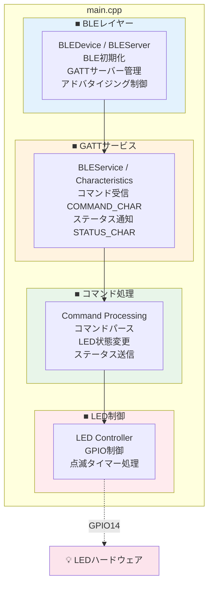
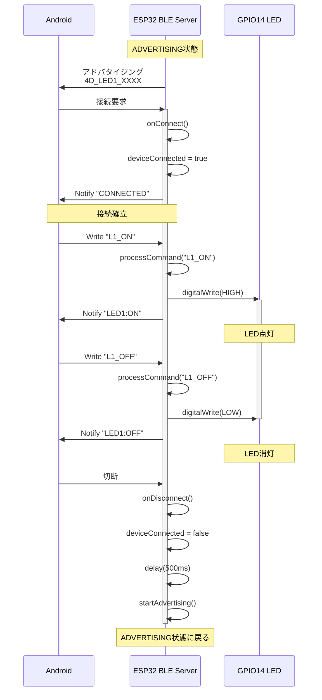
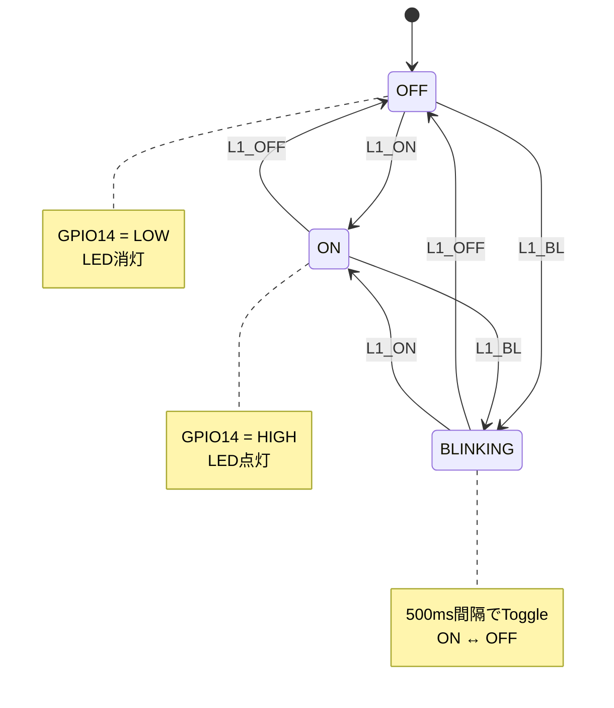

# ESP32 ファームウェア詳細仕様書

**バージョン**: 1.0.0  
**作成日**: 2026年1月30日  
**対象プロジェクト**: bluetooth_test/esp32  

---

## 目次

1. [概要](#1-概要)
2. [ハードウェア仕様](#2-ハードウェア仕様)
3. [開発環境](#3-開発環境)
4. [ファームウェア構成](#4-ファームウェア構成)
5. [BLE通信仕様](#5-ble通信仕様)
6. [LED制御仕様](#6-led制御仕様)
7. [コマンド処理](#7-コマンド処理)
8. [状態遷移](#8-状態遷移)
9. [ソースコード詳細](#9-ソースコード詳細)
10. [ビルドとデプロイ](#10-ビルドとデプロイ)
11. [トラブルシューティング](#11-トラブルシューティング)

---

## 1. 概要

### 1.1 ファームウェア概要

本ファームウェアは、ESP32-WROOM-32開発ボード上で動作し、Bluetooth Low Energy (BLE) を介してAndroidアプリからのコマンドを受信してLEDを制御するシステムである。

### 1.2 主要機能

| 機能 | 説明 |
|:-----|:-----|
| **BLEサーバー** | GATTサーバーとして動作し、クライアント接続を待機 |
| **コマンド受信** | Characteristicへの書き込みでコマンドを受信 |
| **LED制御** | 点灯・消灯・点滅の3モードでLEDを制御 |
| **ステータス通知** | 状態変化をNotifyでクライアントに通知 |
| **自動再アドバタイズ** | 切断時に自動的にアドバタイジング再開 |

### 1.3 デバイスバリエーション

| バリエーション | デバイス名パターン | 対応コマンド | GPIO |
|:---------------|:-------------------|:-------------|:-----|
| **LED1専用** | 4D_LED1_XXXX | L1_ON, L1_OFF, L1_BL | GPIO14 |
| **LED2専用** | 4D_LED2_XXXX | L2_ON, L2_OFF, L2_BL | GPIO14（別ESP32） |
| **統合デバイス** | 4D_Device_XXXX | 両方対応 | GPIO14, GPIO26 |

※ XXXXはMACアドレス下4桁（16進数）

---

## 2. ハードウェア仕様

### 2.1 使用ボード

| 項目 | 仕様 |
|:-----|:-----|
| **ボード名** | ESP32-WROOM-32 DevKitC |
| **MCU** | Tensilica Xtensa LX6 デュアルコア |
| **クロック** | 240 MHz |
| **Flash** | 4 MB |
| **SRAM** | 520 KB |
| **Bluetooth** | BLE 4.2 / Classic |
| **動作電圧** | 3.3V (USB: 5V) |

### 2.2 ピン割り当て

#### LED1専用デバイス / LED2専用デバイス

| ピン | 機能 | 説明 |
|:-----|:-----|:-----|
| GPIO14 | LED出力 | LED制御（アクティブHIGH） |
| GPIO16 | 未使用 | LOW出力（PSRAM対策） |
| GPIO17 | 未使用 | LOW出力（PSRAM対策） |
| USB | 電源/通信 | プログラム書き込み、シリアルモニタ |

#### 統合デバイス（将来対応）

| ピン | 機能 | 説明 |
|:-----|:-----|:-----|
| GPIO14 | LED1出力 | LED1制御 |
| GPIO26 | LED2出力 | LED2制御 |
| GPIO16 | 未使用 | LOW出力（PSRAM対策） |
| GPIO17 | 未使用 | LOW出力（PSRAM対策） |

### 2.3 回路構成

```
ESP32 GPIO14 ──[抵抗 220Ω]──LED(+)──LED(-)──GND
```

#### 抵抗値計算

```
VCC = 3.3V
Vf (LED順方向電圧) ≈ 2.0V (赤色LED)
If (LED順方向電流) ≈ 5-10mA

R = (VCC - Vf) / If = (3.3 - 2.0) / 0.006 ≈ 217Ω → 220Ω
```

### 2.4 配線図

```
ESP32 DevKitC
┌─────────────────────────────────────────┐
│                                         │
│  [USB]                                  │
│                                         │
│  3V3 ○                         ○ GND    │
│  EN  ○                         ○ GPIO23 │
│  VP  ○                         ○ GPIO22 │
│  VN  ○                         ○ GPIO1  │
│  IO34○                         ○ GPIO3  │
│  IO35○                         ○ GPIO21 │
│  IO32○                         ○ GND    │
│  IO33○                         ○ GPIO19 │
│  IO25○                         ○ GPIO18 │
│  IO26○ ─── LED2出力             ○ GPIO5  │
│  IO27○                         ○ GPIO17 │ ← LOW固定
│  IO14○ ─── LED1出力             ○ GPIO16 │ ← LOW固定
│  IO12○                         ○ GPIO4  │
│  GND ○ ─── LED GND              ○ GPIO0  │
│  IO13○                         ○ GPIO2  │
│  ...                                    │
└─────────────────────────────────────────┘
```

---

## 3. 開発環境

### 3.1 PlatformIO（推奨）

#### プロジェクト構成

```
esp32/
├── platformio.ini      # PlatformIO設定ファイル
├── src/
│   └── main.cpp        # メインファームウェア
├── backup/             # バックアップファイル
│   ├── main_led1.cpp   # LED1専用版
│   ├── main_led2.cpp   # LED2専用版
│   ├── main_backup.cpp # 旧版バックアップ
│   └── main_classic_backup.cpp # Bluetooth Classic版
└── docs/
    ├── setup_guide.md  # 環境構築ガイド
    └── wiring_tutorial.md # 配線チュートリアル
```

#### platformio.ini

```ini
[env:esp32dev]
platform = espressif32
board = esp32dev
framework = arduino

; シリアルモニタ設定
monitor_speed = 115200

; ビルドフラグ
build_flags = 
    -D LED_BUILTIN=2
    -D BOARD_HAS_PSRAM=0

; ボード設定（PSRAM無効化）
board_build.psram.mode = disabled

; アップロード設定
upload_speed = 921600
```

### 3.2 必要ライブラリ

| ライブラリ | バージョン | 用途 |
|:-----------|:-----------|:-----|
| Arduino.h | ESP32組み込み | Arduinoフレームワーク |
| BLEDevice.h | ESP32組み込み | BLEデバイス管理 |
| BLEServer.h | ESP32組み込み | GATTサーバー |
| BLEUtils.h | ESP32組み込み | BLEユーティリティ |
| BLE2902.h | ESP32組み込み | CCCD（通知設定） |

### 3.3 開発フロー

```
1. PlatformIOプロジェクトを開く
      ↓
2. src/main.cpp を編集
      ↓
3. ビルド: pio run
      ↓
4. 書き込み: pio run --target upload
      ↓
5. 確認: pio device monitor
```

---

## 4. ファームウェア構成

### 4.1 ファイル構成

```cpp
// main.cpp の構成
// =====================================================
// 1. ヘッダーインクルード
// =====================================================
#include <Arduino.h>
#include <BLEDevice.h>
#include <BLEServer.h>
#include <BLEUtils.h>
#include <BLE2902.h>

// =====================================================
// 2. 定数定義（UUID、ピン番号、タイミング）
// =====================================================

// =====================================================
// 3. 状態列挙型
// =====================================================

// =====================================================
// 4. グローバル変数
// =====================================================

// =====================================================
// 5. 関数プロトタイプ
// =====================================================

// =====================================================
// 6. BLEコールバッククラス
// =====================================================

// =====================================================
// 7. setup() 関数
// =====================================================

// =====================================================
// 8. loop() 関数
// =====================================================

// =====================================================
// 9. ユーティリティ関数
// =====================================================
```

### 4.2 主要コンポーネント



---

## 5. BLE通信仕様

### 5.1 GATT構成

```
GATT Server
└── Service: 4D580001-0000-1000-8000-00805F9B34FB
    ├── Characteristic: Command (4D580002-...)
    │   ├── Properties: Write, Write No Response
    │   └── Value: コマンド文字列
    └── Characteristic: Status (4D580003-...)
        ├── Properties: Read, Notify
        ├── Descriptor: CCCD (2902)
        └── Value: ステータス文字列
```

### 5.2 UUID定義

| 要素 | UUID | 説明 |
|:-----|:-----|:-----|
| **Service** | 4D580001-0000-1000-8000-00805F9B34FB | 4DXエフェクトサービス |
| **Command Characteristic** | 4D580002-0000-1000-8000-00805F9B34FB | コマンド書き込み用 |
| **Status Characteristic** | 4D580003-0000-1000-8000-00805F9B34FB | ステータス通知用 |
| **CCCD** | 00002902-0000-1000-8000-00805f9b34fb | 通知設定用 |

### 5.3 デバイス名生成

```cpp
String getDeviceName() {
    uint8_t mac[6];
    esp_read_mac(mac, ESP_MAC_BT);
    char name[20];
    sprintf(name, "4D_LED1_%02X%02X", mac[4], mac[5]);
    return String(name);
}
```

**出力例**: `4D_LED1_A1B2`

### 5.4 アドバタイジング設定

```cpp
BLEAdvertising* pAdvertising = BLEDevice::getAdvertising();
pAdvertising->addServiceUUID(SERVICE_UUID);  // サービスUUIDを広告
pAdvertising->setScanResponse(true);         // スキャンレスポンス有効
pAdvertising->setMinPreferred(0x06);         // 最小接続間隔
pAdvertising->setMinPreferred(0x12);         // 最大接続間隔
BLEDevice::startAdvertising();
```

### 5.5 接続管理

#### 接続時
```cpp
void onConnect(BLEServer* pServer) {
    deviceConnected = true;
    sendStatus("CONNECTED");
}
```

#### 切断時
```cpp
void onDisconnect(BLEServer* pServer) {
    deviceConnected = false;
    // 再アドバタイジング
    delay(500);
    BLEDevice::startAdvertising();
}
```

**BLE接続シーケンス:**



---

## 6. LED制御仕様

### 6.1 LED状態定義

```cpp
enum class LedState {
    OFF,       // 消灯
    ON,        // 点灯
    BLINKING   // 点滅
};
```

### 6.2 状態遷移図



### 6.3 点滅処理

```cpp
const unsigned long BLINK_INTERVAL_MS = 500;  // 500ms間隔

void updateBlink() {
    unsigned long now = millis();
    if (now - lastBlinkTime >= BLINK_INTERVAL_MS) {
        ledOn = !ledOn;
        setLed(ledOn);
        lastBlinkTime = now;
    }
}
```

**点滅パターン:**
```
    500ms      500ms      500ms      500ms
├──────────┼──────────┼──────────┼──────────┤
│    ON    │   OFF    │    ON    │   OFF    │
└──────────┴──────────┴──────────┴──────────┘
```

### 6.4 GPIO制御

```cpp
void setLed(bool on) {
    digitalWrite(LED_PIN, on ? HIGH : LOW);
}
```

---

## 7. コマンド処理

### 7.1 コマンド形式

```
[デバイス識別子]_[操作]
```

| 形式 | 例 | 説明 |
|:-----|:---|:-----|
| L1_ON | LED1点灯 | LED1を点灯状態にする |
| L1_OFF | LED1消灯 | LED1を消灯状態にする |
| L1_BL | LED1点滅 | LED1を点滅状態にする |
| L2_ON | LED2点灯 | LED2を点灯状態にする |
| L2_OFF | LED2消灯 | LED2を消灯状態にする |
| L2_BL | LED2点滅 | LED2を点滅状態にする |

### 7.2 コマンドパース処理

```cpp
void processCommand(const String& cmd) {
    // LED1コマンド
    if (cmd.startsWith("L1_")) {
        String mode = cmd.substring(3);  // "ON", "OFF", "BL"
        
        if (mode == "ON") {
            ledState = LedState::ON;
            setLed(true);
            sendStatus("LED1:ON");
        }
        else if (mode == "OFF") {
            ledState = LedState::OFF;
            setLed(false);
            sendStatus("LED1:OFF");
        }
        else if (mode == "BL") {
            ledState = LedState::BLINKING;
            lastBlinkTime = millis();
            ledOn = true;
            setLed(true);
            sendStatus("LED1:BLINK");
        }
    }
    // LED2コマンド（LED1専用機では無視）
    else if (cmd.startsWith("L2_")) {
        Serial.println("Ignoring LED2 command");
    }
    // その他のエフェクトコマンド（未実装）
    else if (cmd.startsWith("V_") || cmd.startsWith("F_") || ...) {
        Serial.println("Ignoring effect command");
    }
    // 不明なコマンド
    else {
        sendStatus("ERR:UNKNOWN");
    }
}
```

**処理フローチャート:**

```mermaid
flowchart TD
    Start([CommandCallback::onWrite])
    Start --> GetValue[cmd = getValue]
    GetValue --> CheckL1{cmd.startsWith<br/>"L1_"?}
    
    CheckL1 -->|Yes| GetMode[mode = cmd.substring\(3\)]
    GetMode --> CheckMode{mode?}
    
    CheckMode -->|"ON"| SetON[ledState = ON<br/>setLed\(true\)<br/>sendStatus\("LED1:ON"\)]
    CheckMode -->|"OFF"| SetOFF[ledState = OFF<br/>setLed\(false\)<br/>sendStatus\("LED1:OFF"\)]
    CheckMode -->|"BL"| SetBL[ledState = BLINKING<br/>lastBlinkTime = millis\(\)<br/>setLed\(true\)<br/>sendStatus\("LED1:BLINK"\)]
    CheckMode -->|Other| Unknown
    
    CheckL1 -->|No| CheckL2{cmd.startsWith<br/>"L2_"?}
    CheckL2 -->|Yes| IgnoreL2[Serial.println\("Ignoring LED2"\)]
    CheckL2 -->|No| CheckEffect{cmd.startsWith<br/>"V_", "F_", etc?}
    CheckEffect -->|Yes| IgnoreEff[Serial.println\("Ignoring effect"\)]
    CheckEffect -->|No| Unknown[sendStatus\("ERR:UNKNOWN"\)]
    
    SetON --> End([return])
    SetOFF --> End
    SetBL --> End
    IgnoreL2 --> End
    IgnoreEff --> End
    Unknown --> End
    
    style Start fill:#4caf50,color:#fff
    style End fill:#f44336,color:#fff
    style SetON fill:#2196f3,color:#fff
    style SetOFF fill:#607d8b,color:#fff
    style SetBL fill:#ff9800,color:#fff
```

### 7.3 ステータス通知

```cpp
void sendStatus(const String& status) {
    if (deviceConnected && pStatusCharacteristic != nullptr) {
        pStatusCharacteristic->setValue(status.c_str());
        pStatusCharacteristic->notify();
    }
}
```

**ステータス一覧:**

| ステータス | 意味 |
|:-----------|:-----|
| CONNECTED | 接続成功 |
| LED1:ON | LED1点灯 |
| LED1:OFF | LED1消灯 |
| LED1:BLINK | LED1点滅 |
| LED2:ON | LED2点灯 |
| LED2:OFF | LED2消灯 |
| LED2:BLINK | LED2点滅 |
| ERR:UNKNOWN | 不明なコマンド |

---

## 8. 状態遷移

### 8.1 システム状態遷移

```
┌─────────────┐
│   POWER ON  │
└──────┬──────┘
       │
       ▼
┌─────────────┐
│  INIT GPIO  │  GPIO初期化、LED消灯
└──────┬──────┘
       │
       ▼
┌─────────────┐
│  INIT BLE   │  BLEデバイス初期化
└──────┬──────┘
       │
       ▼
┌─────────────┐
│ ADVERTISING │◀────────────────────────┐
└──────┬──────┘                          │
       │ 接続                            │ 切断
       ▼                                 │
┌─────────────┐                          │
│  CONNECTED  │──────────────────────────┘
└──────┬──────┘
       │
       ▼
┌─────────────┐
│   READY     │  コマンド受信待機
└──────┬──────┘
       │ コマンド受信
       ▼
┌─────────────┐
│  PROCESSING │  コマンド処理 → LED制御
└─────────────┘
```

### 8.2 メインループ処理

```cpp
void loop() {
    // 1. 接続状態変化のチェック
    if (!deviceConnected && oldDeviceConnected) {
        delay(500);
        BLEDevice::startAdvertising();  // 再アドバタイズ
        oldDeviceConnected = deviceConnected;
    }
    if (deviceConnected && !oldDeviceConnected) {
        oldDeviceConnected = deviceConnected;
    }

    // 2. 点滅状態の更新
    if (ledState == LedState::BLINKING) {
        updateBlink();
    }

    // 3. CPU負荷軽減
    delay(10);
}
```

**loop()処理フロー:**

```mermaid
flowchart TD
    Start([loop開始])
    Start --> CheckDisconnect{切断検出?<br/>!deviceConnected &&<br/>oldDeviceConnected}
    
    CheckDisconnect -->|Yes| Delay[delay\(500\)]
    Delay --> Restart[BLEDevice::startAdvertising\(\)]
    Restart --> UpdateOld1[oldDeviceConnected<br/>= deviceConnected]
    UpdateOld1 --> CheckConnect
    
    CheckDisconnect -->|No| CheckConnect{接続検出?<br/>deviceConnected &&<br/>!oldDeviceConnected}
    
    CheckConnect -->|Yes| UpdateOld2[oldDeviceConnected<br/>= deviceConnected]
    UpdateOld2 --> CheckBlink
    
    CheckConnect -->|No| CheckBlink{ledState ==<br/>BLINKING?}
    
    CheckBlink -->|Yes| CallBlink[updateBlink\(\)]
    CallBlink --> CPUDelay
    
    CheckBlink -->|No| CPUDelay[delay\(10\)]
    
    CPUDelay --> End([loop終了])
    End -.10ms後.-> Start
    
    style Start fill:#4caf50,color:#fff
    style End fill:#4caf50,color:#fff
    style Restart fill:#ff9800,color:#fff
    style CallBlink fill:#2196f3,color:#fff
```

---

## 9. ソースコード詳細

### 9.1 完全なソースコード構成

```cpp
/**
 * ESP32 LED1専用コントローラー (BLE版)
 */

// === インクルード ===
#include <Arduino.h>
#include <BLEDevice.h>
#include <BLEServer.h>
#include <BLEUtils.h>
#include <BLE2902.h>

// === UUID定義 ===
#define SERVICE_UUID        "4D580001-0000-1000-8000-00805F9B34FB"
#define COMMAND_CHAR_UUID   "4D580002-0000-1000-8000-00805F9B34FB"
#define STATUS_CHAR_UUID    "4D580003-0000-1000-8000-00805F9B34FB"

// === ピン設定 ===
const int LED_PIN = 14;
const unsigned long BLINK_INTERVAL_MS = 500;

// === 状態定義 ===
enum class LedState { OFF, ON, BLINKING };

// === グローバル変数 ===
BLEServer* pServer = nullptr;
BLECharacteristic* pCommandCharacteristic = nullptr;
BLECharacteristic* pStatusCharacteristic = nullptr;

bool deviceConnected = false;
bool oldDeviceConnected = false;

LedState ledState = LedState::OFF;
unsigned long lastBlinkTime = 0;
bool ledOn = false;

String deviceName = "";

// === 関数プロトタイプ ===
String getDeviceName();
void processCommand(const String& cmd);
void updateBlink();
void setLed(bool on);
void sendStatus(const String& status);

// === BLEコールバック ===
class ServerCallbacks : public BLEServerCallbacks {
    void onConnect(BLEServer* pServer) override {
        deviceConnected = true;
        sendStatus("CONNECTED");
    }
    void onDisconnect(BLEServer* pServer) override {
        deviceConnected = false;
    }
};

class CommandCallbacks : public BLECharacteristicCallbacks {
    void onWrite(BLECharacteristic* pCharacteristic) override {
        String value = pCharacteristic->getValue().c_str();
        if (value.length() > 0) {
            processCommand(value);
        }
    }
};

// === setup() ===
void setup() {
    Serial.begin(115200);
    
    // GPIO 16/17 対策
    pinMode(16, OUTPUT); digitalWrite(16, LOW);
    pinMode(17, OUTPUT); digitalWrite(17, LOW);
    
    // LED初期化
    pinMode(LED_PIN, OUTPUT);
    setLed(false);
    
    // デバイス名生成
    deviceName = getDeviceName();
    
    // BLE初期化
    BLEDevice::init(deviceName.c_str());
    pServer = BLEDevice::createServer();
    pServer->setCallbacks(new ServerCallbacks());
    
    // サービス作成
    BLEService* pService = pServer->createService(SERVICE_UUID);
    
    // コマンドCharacteristic
    pCommandCharacteristic = pService->createCharacteristic(
        COMMAND_CHAR_UUID,
        BLECharacteristic::PROPERTY_WRITE | 
        BLECharacteristic::PROPERTY_WRITE_NR
    );
    pCommandCharacteristic->setCallbacks(new CommandCallbacks());
    
    // ステータスCharacteristic
    pStatusCharacteristic = pService->createCharacteristic(
        STATUS_CHAR_UUID,
        BLECharacteristic::PROPERTY_READ | 
        BLECharacteristic::PROPERTY_NOTIFY
    );
    pStatusCharacteristic->addDescriptor(new BLE2902());
    
    // サービス開始
    pService->start();
    
    // アドバタイジング開始
    BLEAdvertising* pAdvertising = BLEDevice::getAdvertising();
    pAdvertising->addServiceUUID(SERVICE_UUID);
    pAdvertising->setScanResponse(true);
    BLEDevice::startAdvertising();
}

// === loop() ===
void loop() {
    // 再接続処理
    if (!deviceConnected && oldDeviceConnected) {
        delay(500);
        BLEDevice::startAdvertising();
        oldDeviceConnected = deviceConnected;
    }
    if (deviceConnected && !oldDeviceConnected) {
        oldDeviceConnected = deviceConnected;
    }
    
    // 点滅更新
    if (ledState == LedState::BLINKING) {
        updateBlink();
    }
    
    delay(10);
}

// === ユーティリティ関数 ===
// (processCommand, getDeviceName, updateBlink, setLed, sendStatus)
```

### 9.2 LED2専用版との差分

| 項目 | LED1版 | LED2版 |
|:-----|:-------|:-------|
| デバイス名 | 4D_LED1_XXXX | 4D_LED2_XXXX |
| 処理コマンド | L1_* | L2_* |
| 無視コマンド | L2_* | L1_* |

```cpp
// LED2版の getDeviceName()
String getDeviceName() {
    ...
    sprintf(name, "4D_LED2_%02X%02X", mac[4], mac[5]);  // LED2に変更
    ...
}

// LED2版の processCommand()
void processCommand(const String& cmd) {
    if (cmd.startsWith("L2_")) {  // L2_* を処理
        ...
    }
    else if (cmd.startsWith("L1_")) {  // L1_* を無視
        Serial.println("Ignoring LED1 command");
    }
}
```

---

## 10. ビルドとデプロイ

### 10.1 PlatformIOコマンド

```bash
# プロジェクトディレクトリへ移動
cd esp32/

# ビルドのみ
pio run

# ビルド＆書き込み
pio run --target upload

# シリアルモニタを開く
pio device monitor

# ビルド＆書き込み＆モニタ（一括）
pio run --target upload && pio device monitor
```

### 10.2 Arduino IDE手順

1. `esp32/src/main.cpp` の内容をArduino IDEにコピー
2. ボード設定:
   - Board: ESP32 Dev Module
   - Upload Speed: 921600
   - CPU Frequency: 240MHz
   - Flash Frequency: 80MHz
3. ツール → シリアルポートを選択
4. スケッチ → 書き込み

### 10.3 書き込み確認

シリアルモニタ出力例:
```
=================================
ESP32 LED1 Controller (BLE)
=================================
Device name: 4D_LED1_A1B2
LED pin: GPIO14
BLE advertising started
Supported commands: L1_ON, L1_OFF, L1_BL
Waiting for connection...
```

### 10.4 複数デバイスの準備

```
1. ESP32 #1 に main_led1.cpp を書き込み
   → デバイス名: 4D_LED1_XXXX

2. ESP32 #2 に main_led2.cpp を書き込み
   → デバイス名: 4D_LED2_YYYY
```

---

## 11. トラブルシューティング

### 11.1 一般的な問題

| 症状 | 原因 | 対処法 |
|:-----|:-----|:-------|
| LEDが点灯しない | 配線ミス | GPIO14からLED、抵抗、GNDの接続を確認 |
| LEDが常時点灯 | 極性逆 | LED の +/- を確認 |
| BLEが見つからない | 初期化失敗 | ESP32をリセット、シリアルモニタ確認 |
| 接続がすぐ切れる | 電波干渉 | 距離を近づける、他のBLE機器を離す |
| 書き込みエラー | ポート競合 | シリアルモニタを閉じて再試行 |

### 11.2 ビルドエラー

| エラー | 原因 | 対処法 |
|:-----|:-----|:-------|
| multiple definition | src/に複数の.cppファイル | 使用するファイル以外をbackup/へ移動 |
| BLEDevice.h not found | プラットフォーム未インストール | `pio platform install espressif32` |
| Upload failed | ポート認識されない | USBケーブル/ドライバ確認 |

### 11.3 GPIO 16/17 問題

一部のESP32ボードでPSRAM関連のGPIO 16/17が干渉する問題がある。対策として、setup()内でLOW固定出力する:

```cpp
// GPIO 16/17 問題対策
pinMode(16, OUTPUT);
digitalWrite(16, LOW);
pinMode(17, OUTPUT);
digitalWrite(17, LOW);
```

### 11.4 デバッグ方法

1. **シリアルモニタ確認**
   ```
   pio device monitor
   ```

2. **BLEスキャンツール使用**
   - nRF Connect (Android/iOS)
   - LightBlue (iOS)

3. **LED直接テスト**
   ```cpp
   // setup() 内でテスト
   setLed(true);
   delay(1000);
   setLed(false);
   ```

---

## 付録

### A. 部品リスト

| 部品 | 数量 | 備考 |
|:-----|:----:|:-----|
| ESP32-WROOM-32 DevKitC | 1-2 | LED1用、LED2用 |
| LED 5mm | 2 | 赤、緑など色を分ける |
| 抵抗 220Ω | 2 | 1/4W |
| ブレッドボード | 1 | ハーフサイズ以上 |
| ジャンパーワイヤー | 5-6 | オス-オス |
| USB Micro-Bケーブル | 1-2 | データ転送対応 |

### B. 参考資料

- [ESP32 公式ドキュメント](https://docs.espressif.com/projects/esp-idf/en/latest/esp32/)
- [PlatformIO ドキュメント](https://docs.platformio.org/)
- [ESP32 BLE Arduino ライブラリ](https://github.com/espressif/arduino-esp32/tree/master/libraries/BLE)

---

**更新履歴**

| バージョン | 日付 | 変更内容 |
|:-----------|:-----|:---------|
| 1.0.0 | 2026-01-30 | 初版作成 |
