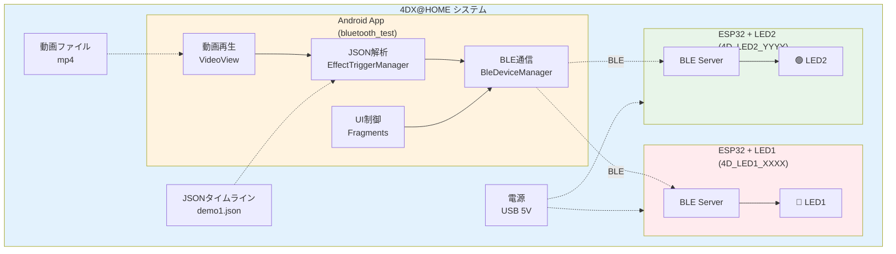
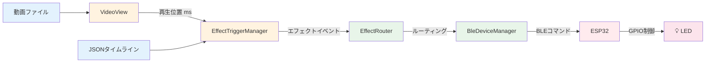
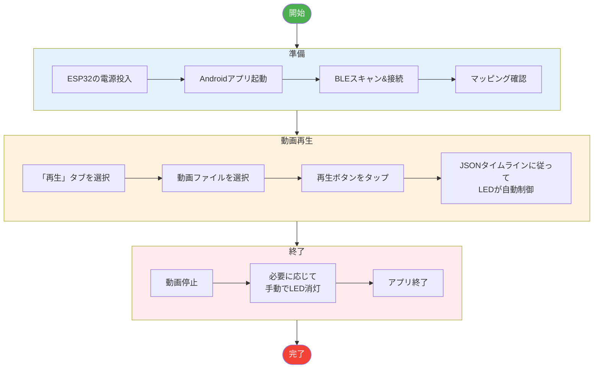

# システム統合仕様書

**バージョン**: 1.0.0  
**作成日**: 2026年1月30日  
**対象プロジェクト**: bluetooth_test  

---

## 目次

1. [システム概要](#1-システム概要)
2. [システム構成](#2-システム構成)
3. [セットアップ手順](#3-セットアップ手順)
4. [運用手順](#4-運用手順)
5. [JSONタイムライン仕様](#5-jsonタイムライン仕様)
6. [トラブルシューティング](#6-トラブルシューティング)
7. [開発ガイドライン](#7-開発ガイドライン)
8. [拡張計画](#8-拡張計画)

---

## 1. システム概要

### 1.1 システム名称

**4DX@HOME LED制御システム**

### 1.2 システム目的

動画再生に同期して、BLE接続されたESP32デバイスを介して物理的なLEDを制御する体験型エンターテインメントシステム。

### 1.3 主要機能

| 機能 | 説明 |
|:-----|:-----|
| **BLEデバイス管理** | 複数ESP32の検出・接続・管理 |
| **エフェクトマッピング** | エフェクトタイプとデバイスの関連付け |
| **手動LED制御** | ユーザー操作によるLED点灯/消灯/点滅 |
| **動画連動制御** | JSONタイムラインに基づく自動エフェクト発火 |
| **リアルタイム同期** | 動画再生位置とエフェクトの精密同期 |

### 1.4 システム構成図



---

## 2. システム構成

### 2.1 コンポーネント一覧

| コンポーネント | 説明 | 必要数 |
|:---------------|:-----|:------:|
| Android端末 | アプリ実行、動画再生 | 1台 |
| ESP32-WROOM-32 | BLEデバイス、LED制御 | 1-2台 |
| LED | 視覚フィードバック | 2個 |
| 抵抗 220Ω | 電流制限 | 2個 |
| ブレッドボード | 配線用 | 1個 |
| USBケーブル (Micro-B) | ESP32電源/書込 | 1-2本 |

### 2.2 ソフトウェア構成

| 層 | コンポーネント | 技術 |
|:---|:---------------|:-----|
| **Android App** | MainActivity | Navigation Component |
| | SettingsFragment | BLE管理UI |
| | ControlFragment | 手動制御UI |
| | PlaybackFragment | 動画再生UI |
| | BleDeviceManager | BLE通信 |
| | EffectRouter | ルーティング |
| **ESP32 FW** | main.cpp | Arduino Framework |
| | BLE Server | ESP32 BLE |
| | LED Controller | GPIO制御 |

### 2.3 データフロー



---

## 3. セットアップ手順

### 3.1 ハードウェアセットアップ

#### 3.1.1 必要部品の準備

```
チェックリスト:
□ ESP32-WROOM-32 開発ボード × 1-2
□ LED 5mm × 2 (異なる色推奨)
□ 抵抗 220Ω × 2
□ ブレッドボード × 1
□ ジャンパーワイヤー × 6
□ USB Micro-B ケーブル × 1-2
□ Android端末 (API 26以上)
```

#### 3.1.2 配線手順

**ESP32 #1 (LED1用)**

```
1. ESP32をブレッドボードに設置
2. GPIO14 → 抵抗(220Ω) → LED(+) → LED(-) → GND
3. USBケーブルでPCに接続
```

**ESP32 #2 (LED2用、オプション)**

```
1. 別のESP32をブレッドボードに設置
2. GPIO14 → 抵抗(220Ω) → LED(+) → LED(-) → GND
3. USBケーブルでPCに接続
```

#### 3.1.3 配線確認

```
確認ポイント:
□ LEDの極性（長い足が+）
□ 抵抗が直列に接続されている
□ GNDが正しく接続されている
□ GPIO14に接続されている
```

### 3.2 ESP32ファームウェア書き込み

#### 3.2.1 PlatformIO環境構築

```bash
# 1. VS Codeをインストール
# 2. PlatformIO拡張機能をインストール
# 3. プロジェクトを開く
code esp32/

# 4. 初回ビルド（プラットフォームの自動ダウンロード）
pio run
```

#### 3.2.2 LED1用ファームウェア書き込み

```bash
# ESP32 #1 をUSB接続

# src/main.cpp がLED1版であることを確認
# (backup/main_led1.cpp と同内容)

# ビルド＆書き込み
pio run --target upload

# シリアルモニタで確認
pio device monitor
```

**期待される出力:**
```
=================================
ESP32 LED1 Controller (BLE)
=================================
Device name: 4D_LED1_A1B2
LED pin: GPIO14
BLE advertising started
```

#### 3.2.3 LED2用ファームウェア書き込み（オプション）

```bash
# ESP32 #2 をUSB接続

# src/main.cpp をLED2版に差し替え
cp backup/main_led2.cpp src/main.cpp

# ビルド＆書き込み
pio run --target upload

# シリアルモニタで確認
pio device monitor
```

**期待される出力:**
```
=================================
ESP32 LED2 Controller (BLE)
=================================
Device name: 4D_LED2_C3D4
LED pin: GPIO14
BLE advertising started
```

### 3.3 Androidアプリセットアップ

#### 3.3.1 開発環境

```
要件:
- Android Studio Ladybug (2024.2) 以上
- JDK 11以上
- Gradle 8.12以上
```

#### 3.3.2 プロジェクトのビルド

```bash
# プロジェクトを開く
# Android Studioで bluetooth_test フォルダを開く

# Gradle同期
# File → Sync Project with Gradle Files

# ビルド
./gradlew assembleDebug
```

#### 3.3.3 実機へのインストール

```bash
# デバッグビルド＆インストール
./gradlew installDebug

# または Android Studio から Run
```

#### 3.3.4 権限の許可

アプリ初回起動時:
```
1. Bluetooth権限のダイアログ → 「許可」
2. 位置情報権限のダイアログ → 「許可」（Android 11以下）
```

### 3.4 初期接続テスト

#### 3.4.1 BLEスキャン

```
1. アプリを起動
2. 「設定」タブを選択
3. 「スキャン開始」ボタンをタップ
4. デバイスリストに以下が表示されることを確認:
   - 4D_LED1_XXXX
   - 4D_LED2_YYYY (オプション)
```

#### 3.4.2 デバイス接続

```
1. 検出されたデバイスの「接続」ボタンをタップ
2. 状態が「READY」になることを確認
3. LED2用デバイスも同様に接続（オプション）
```

#### 3.4.3 マッピング設定

```
1. 「エフェクト → デバイス割当」セクションで:
   - LED1 → 4D_LED1_XXXX を選択
   - LED2 → 4D_LED2_YYYY を選択（オプション）
```

#### 3.4.4 手動テスト

```
1. 「制御」タブを選択
2. LED1の「点灯」ボタンをタップ
3. ESP32のLEDが点灯することを確認
4. 「消灯」ボタンで消灯を確認
5. 「点滅」ボタンで点滅を確認
```

---

## 4. 運用手順

### 4.1 通常運用フロー



### 4.2 動画ファイルの準備

#### 対応フォーマット

| 項目 | 仕様 |
|:-----|:-----|
| コンテナ | MP4, 3GP |
| ビデオコーデック | H.264, H.265 |
| オーディオコーデック | AAC, MP3 |
| 推奨解像度 | 720p (1280x720) |
| 推奨フレームレート | 30fps |

#### 動画の配置

**端末ストレージから選択:**
```
1. 動画を端末にコピー
2. アプリの「動画を選択」から選択
```

**アプリ内蔵（開発用）:**
```
動画を app/src/main/res/raw/ に配置
例: app/src/main/res/raw/demo1.mp4
```

### 4.3 JSONタイムラインの準備

#### ファイル配置

```
app/src/main/assets/
├── demo1.json        # LEDデモ用
└── 4dx_demo.json     # 4DXデモ用
```

#### JSONの編集

エディタでJSONファイルを編集し、動画に合わせてタイミングを調整:

```json
{
  "version": "1.0",
  "title": "カスタムタイムライン",
  "events": [
    {"t": 0.0, "action": "caption", "text": "開始"},
    {"t": 1.0, "action": "start", "effect": "led1", "mode": "on"},
    {"t": 3.0, "action": "stop", "effect": "led1"},
    {"t": 4.0, "action": "start", "effect": "led2", "mode": "blink"},
    {"t": 6.0, "action": "stop", "effect": "led2"}
  ]
}
```

---

## 5. JSONタイムライン仕様

### 5.1 ファイル構造

```json
{
  "version": "1.0",
  "title": "タイトル",
  "description": "説明",
  "events": [
    // イベント配列
  ]
}
```

### 5.2 イベント種別

#### caption（字幕/マーカー）

```json
{"t": 0.0, "action": "caption", "text": "表示テキスト"}
```

| フィールド | 型 | 説明 |
|:-----------|:---|:-----|
| t | number | 発火時刻（秒） |
| action | string | "caption" |
| text | string | 表示テキスト |

#### start（エフェクト開始）

```json
{"t": 1.5, "action": "start", "effect": "led1", "mode": "on"}
```

| フィールド | 型 | 説明 |
|:-----------|:---|:-----|
| t | number | 発火時刻（秒） |
| action | string | "start" |
| effect | string | エフェクトタイプ |
| mode | string | モード |

#### stop（エフェクト停止）

```json
{"t": 3.0, "action": "stop", "effect": "led1"}
```

| フィールド | 型 | 説明 |
|:-----------|:---|:-----|
| t | number | 発火時刻（秒） |
| action | string | "stop" |
| effect | string | エフェクトタイプ |
| mode | string | （オプション） |

#### shot（単発エフェクト）

```json
{"t": 2.0, "action": "shot", "effect": "flash", "mode": "fast_blink"}
```

| フィールド | 型 | 説明 |
|:-----------|:---|:-----|
| t | number | 発火時刻（秒） |
| action | string | "shot" |
| effect | string | エフェクトタイプ |
| mode | string | モード |

### 5.3 対応エフェクトタイプ

| effect | 説明 | 対応モード |
|:-------|:-----|:-----------|
| led1 | LED1 | on, blink |
| led2 | LED2 | on, blink |
| vibration | 振動 | up_weak, heartbeat, etc. |
| flash | 光 | steady, slow_blink, fast_blink |
| wind | 風 | on |
| water | 水 | burst |
| color | 色 | red, green, blue, etc. |

### 5.4 サンプルタイムライン

#### demo1.json（LED制御テスト）

```json
{
  "version": "1.0",
  "title": "demo1 LED制御テスト",
  "description": "LED1とLED2の2台ESP32連携デモ",
  "events": [
    { "t": 2.0, "action": "start", "effect": "led1", "mode": "on" },
    { "t": 5.0, "action": "stop", "effect": "led1", "mode": "on" },
    { "t": 6.5, "action": "start", "effect": "led2", "mode": "blink" },
    { "t": 10.0, "action": "stop", "effect": "led2", "mode": "blink" },
    { "t": 12.25, "action": "start", "effect": "led1", "mode": "blink" },
    { "t": 15.5, "action": "stop", "effect": "led1", "mode": "blink" },
    { "t": 16.0, "action": "start", "effect": "led2", "mode": "on" },
    { "t": 18.75, "action": "start", "effect": "led1", "mode": "on" },
    { "t": 20.0, "action": "stop", "effect": "led2", "mode": "on" },
    { "t": 22.5, "action": "stop", "effect": "led1", "mode": "on" },
    { "t": 24.0, "action": "start", "effect": "led1", "mode": "blink" },
    { "t": 24.0, "action": "start", "effect": "led2", "mode": "blink" },
    { "t": 28.0, "action": "stop", "effect": "led1", "mode": "blink" },
    { "t": 28.0, "action": "stop", "effect": "led2", "mode": "blink" }
  ]
}
```

#### 4dx_demo.json（4DX形式デモ）

```json
{
  "version": "1.0",
  "title": "4DX@HOME デモ",
  "description": "LED1/LED2 の動作確認用デモ",
  "events": [
    {"t": 0.0, "action": "caption", "text": "デモ開始"},
    {"t": 1.0, "action": "start", "effect": "led1", "mode": "on"},
    {"t": 2.0, "action": "start", "effect": "led2", "mode": "on"},
    {"t": 3.0, "action": "stop", "effect": "led1"},
    {"t": 3.5, "action": "start", "effect": "led1", "mode": "blink"},
    {"t": 4.0, "action": "stop", "effect": "led2"},
    {"t": 4.5, "action": "start", "effect": "led2", "mode": "blink"},
    {"t": 6.0, "action": "stop", "effect": "led1"},
    {"t": 6.0, "action": "stop", "effect": "led2"},
    {"t": 6.5, "action": "shot", "effect": "flash", "mode": "fast_blink"},
    {"t": 7.0, "action": "shot", "effect": "vibration", "mode": "up_down_strong"},
    {"t": 8.0, "action": "caption", "text": "デモ終了"}
  ]
}
```

---

## 6. トラブルシューティング

### 6.1 BLE接続問題

| 症状 | 原因 | 対処法 |
|:-----|:-----|:-------|
| デバイスが検出されない | ESP32電源OFF | USBケーブル接続確認 |
| | BT無効 | Android設定でBT有効化 |
| | 距離が遠い | 3m以内に近づける |
| | 他アプリが接続中 | 他アプリを終了 |
| 接続が切れる | 電波干渉 | WiFiルーターから離す |
| | ESP32リセット | シリアルモニタで確認 |
| | タイムアウト | 再接続を試行 |
| 接続がREADYにならない | サービス未検出 | ESP32のファームウェア確認 |
| | UUID不一致 | UUID定義を確認 |

### 6.2 LED制御問題

| 症状 | 原因 | 対処法 |
|:-----|:-----|:-------|
| LEDが点灯しない | 配線ミス | GPIO14とGND確認 |
| | 極性逆 | LED +/- を確認 |
| | 抵抗断線 | 抵抗を交換 |
| | コマンド未受信 | シリアルモニタ確認 |
| LEDが暗い | 抵抗値が大きい | 220Ωに交換 |
| 点滅しない | 状態遷移ミス | 一度OFFにしてからBL |

### 6.3 動画再生問題

| 症状 | 原因 | 対処法 |
|:-----|:-----|:-------|
| 動画が再生されない | フォーマット非対応 | MP4/H.264に変換 |
| | ファイル破損 | 他プレイヤーで確認 |
| 同期がずれる | JSON時刻ずれ | タイムライン修正 |
| | 遅延大 | SYNC_MARGINを調整 |
| エフェクト発火しない | マッピング未設定 | 設定画面で確認 |
| | JSON読み込み失敗 | ログで確認 |

### 6.4 ビルドエラー

| エラー | 原因 | 対処法 |
|:-----|:-----|:-------|
| Gradle sync失敗 | バージョン不一致 | gradle-wrapper更新 |
| | ネットワークエラー | 再試行/プロキシ設定 |
| multiple definition (ESP32) | 複数.cppファイル | src/に1つだけ残す |
| Permission denied | USB権限なし | udevルール追加 |

### 6.5 ログ確認方法

#### Android（Logcat）

```bash
# フィルタリング
adb logcat | grep -E "(BleDeviceManager|BleScanner|EffectRouter)"
```

#### ESP32（シリアルモニタ）

```bash
pio device monitor
# または
screen /dev/ttyUSB0 115200
```

---

## 7. 開発ガイドライン

### 7.1 コーディング規約

#### Kotlin（Android）

```kotlin
// 命名規則
class BleScannerManager { }      // クラス: PascalCase
fun connectDevice() { }          // 関数: camelCase
val deviceName: String           // 変数: camelCase
const val TIMEOUT_MS = 10000L    // 定数: SCREAMING_SNAKE_CASE

// ファイル構成
// 1. パッケージ宣言
// 2. import
// 3. クラス定義
//    - companion object
//    - プロパティ
//    - 初期化ブロック
//    - 公開メソッド
//    - 非公開メソッド
```

#### C++ (ESP32)

```cpp
// 命名規則
class LedController { }          // クラス: PascalCase
void processCommand() { }        // 関数: camelCase
bool deviceConnected;            // 変数: camelCase
const int LED_PIN = 14;          // 定数: SCREAMING_SNAKE_CASE

// ファイル構成
// 1. ヘッダーコメント
// 2. #include
// 3. #define
// 4. 定数定義
// 5. グローバル変数
// 6. 関数プロトタイプ
// 7. クラス定義
// 8. setup()
// 9. loop()
// 10. ユーティリティ関数
```

### 7.2 Git運用

```bash
# ブランチ戦略
main        # 安定版
develop     # 開発版
feature/*   # 機能開発
fix/*       # バグ修正

# コミットメッセージ
feat: 新機能追加
fix: バグ修正
docs: ドキュメント更新
refactor: リファクタリング
```

### 7.3 テスト

#### 単体テスト（Android）

```kotlin
// test/java/com/example/bluetooth_test/
@Test
fun `resolveCommand returns correct command for LED1 on`() {
    val result = EffectCommandResolver.resolveStart(EffectType.LED1, "on")
    assertEquals("L1_ON", result)
}
```

#### 結合テスト

```
1. ESP32をシリアルモニタで監視
2. アプリからコマンド送信
3. ESP32のログでコマンド受信を確認
4. LEDの動作を目視確認
```

---

## 8. 拡張計画

### 8.1 将来の拡張機能

| 機能 | 優先度 | 説明 |
|:-----|:------:|:-----|
| 振動モーター対応 | 高 | PWM制御による振動 |
| RGB LED対応 | 中 | NeoPixel/WS2812B |
| 風ファン対応 | 中 | リレー制御 |
| 水噴射対応 | 低 | ソレノイドバルブ |
| マルチユーザー対応 | 低 | 複数Android同時制御 |

### 8.2 アーキテクチャ拡張

```
現在:
  Android 1台 ──BLE──▶ ESP32 1-2台

将来:
  Android N台 ──BLE──▶ ESP32 M台
       │                   │
       │                   ├── 振動モーター
       │                   ├── RGB LED
       │                   ├── ファン
       │                   └── 水噴射
       │
       └── クラウド同期（オプション）
```

### 8.3 プロトコル拡張

#### 追加予定コマンド

```
// PWM制御（強度指定）
L1_PWM:128    // LED1を50%輝度で点灯
V_PWM:255     // 振動を最大強度で

// タイマー制御
L1_ON:3000    // 3秒後に自動消灯

// 複合コマンド
PATTERN:HEARTBEAT  // 事前定義パターン実行
```

---

## 付録

### A. ファイル一覧

```
bluetooth_test/
├── app/
│   └── src/main/
│       ├── java/com/example/bluetooth_test/
│       │   ├── MainActivity.kt
│       │   ├── ble/
│       │   │   ├── BleConstants.kt
│       │   │   ├── BleConnection.kt
│       │   │   ├── BleDeviceManager.kt
│       │   │   └── BleScanner.kt
│       │   ├── effect/
│       │   │   ├── EffectType.kt
│       │   │   ├── EffectEvent.kt
│       │   │   ├── EffectCommandResolver.kt
│       │   │   └── EffectTriggerManager.kt
│       │   ├── mapping/
│       │   │   ├── EffectDeviceMapping.kt
│       │   │   ├── EffectRouter.kt
│       │   │   └── MappingRepository.kt
│       │   └── ui/
│       │       ├── SharedViewModel.kt
│       │       ├── control/
│       │       ├── playback/
│       │       └── settings/
│       ├── res/
│       │   ├── layout/
│       │   ├── navigation/
│       │   └── menu/
│       └── assets/
│           ├── demo1.json
│           └── 4dx_demo.json
├── esp32/
│   ├── platformio.ini
│   ├── src/main.cpp
│   ├── backup/
│   │   ├── main_led1.cpp
│   │   └── main_led2.cpp
│   └── docs/
│       ├── setup_guide.md
│       └── wiring_tutorial.md
└── docs/
    └── specs/
        ├── 01_android_app_specification.md
        ├── 02_esp32_firmware_specification.md
        ├── 03_ble_protocol_specification.md
        └── 04_system_integration_specification.md
```

### B. 参考リンク

- [ESP32 公式ドキュメント](https://docs.espressif.com/projects/esp-idf/en/latest/esp32/)
- [Android BLE ガイド](https://developer.android.com/guide/topics/connectivity/bluetooth-le)
- [PlatformIO ドキュメント](https://docs.platformio.org/)
- [Kotlin 公式ドキュメント](https://kotlinlang.org/docs/)

### C. 用語集

| 用語 | 説明 |
|:-----|:-----|
| BLE | Bluetooth Low Energy |
| GATT | Generic Attribute Profile |
| UUID | Universally Unique Identifier |
| Characteristic | GATTのデータ属性 |
| Central | BLEのマスター役（Android） |
| Peripheral | BLEのスレーブ役（ESP32） |
| Notify | Peripheralからの通知 |
| CCCD | Client Characteristic Configuration Descriptor |

---

**更新履歴**

| バージョン | 日付 | 変更内容 |
|:-----------|:-----|:---------|
| 1.0.0 | 2026-01-30 | 初版作成 |
