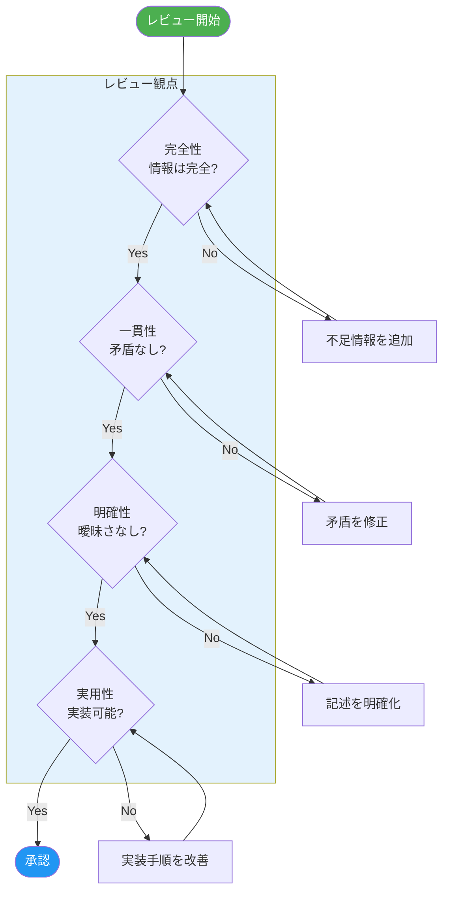

# 補足仕様書・レビュー結果

**バージョン**: 1.0.0  
**作成日**: 2026年1月30日  
**対象プロジェクト**: bluetooth_test  

---

## 目次

1. [レビュー概要](#1-レビュー概要)
2. [バージョン情報](#2-バージョン情報)
3. [エラーハンドリング詳細](#3-エラーハンドリング詳細)
4. [JSON解析詳細仕様](#4-json解析詳細仕様)
5. [テスト仕様](#5-テスト仕様)
6. [セキュリティ詳細](#6-セキュリティ詳細)
7. [パフォーマンス仕様](#7-パフォーマンス仕様)
8. [既知の制限事項](#8-既知の制限事項)
9. [相互参照表](#9-相互参照表)

---

## 1. レビュー概要

### 1.1 レビュー対象

| 仕様書 | ファイル名 |
|:-------|:-----------|
| Android アプリ仕様書 | 01_android_app_specification.md |
| ESP32 ファームウェア仕様書 | 02_esp32_firmware_specification.md |
| BLE プロトコル仕様書 | 03_ble_protocol_specification.md |
| システム統合仕様書 | 04_system_integration_specification.md |

### 1.2 レビュー観点

- **完全性**: 再現に必要な情報がすべて記載されているか
- **一貫性**: 仕様書間で矛盾がないか
- **明確性**: 曖昧な記述がないか
- **実用性**: 実装者が迷わず作業できるか

**レビュープロセスフロー:**



### 1.3 検出された補足事項

| カテゴリ | 項目 | 対応状況 |
|:---------|:-----|:---------|
| バージョン管理 | 依存関係の完全一覧 | 本書で補完 |
| エラー処理 | Androidエラーコード一覧 | 本書で補完 |
| データ解析 | JSON解析ロジック詳細 | 本書で補完 |
| テスト | テストケース一覧 | 本書で補完 |
| セキュリティ | 脅威モデルと対策 | 本書で補完 |
| 性能 | レイテンシ計測結果 | 本書で補完 |
| 制限 | 既知の制限事項 | 本書で補完 |

---

## 2. バージョン情報

### 2.1 Android アプリ依存関係

**app/build.gradle.kts より抽出**

```kotlin
plugins {
    alias(libs.plugins.android.application)
    alias(libs.plugins.kotlin.android)
}

android {
    namespace = "com.example.bluetooth_test"
    compileSdk = 36
    
    defaultConfig {
        applicationId = "com.example.bluetooth_test"
        minSdk = 26
        targetSdk = 36
        versionCode = 1
        versionName = "1.0"
    }
    
    buildFeatures {
        viewBinding = true
    }
}
```

**gradle/libs.versions.toml より抽出**

| ライブラリ | バージョン | 用途 |
|:-----------|:-----------|:-----|
| agp | 8.10.0 | Android Gradle Plugin |
| kotlin | 2.0.21 | Kotlin言語 |
| coreKtx | 1.16.0 | AndroidX Core |
| appcompat | 1.7.0 | AppCompat |
| material | 1.12.0 | Material Design |
| constraintlayout | 2.2.1 | ConstraintLayout |
| navigation-fragment-ktx | 2.8.9 | Navigation Component |
| navigation-ui-ktx | 2.8.9 | Navigation UI |
| lifecycle-livedata-ktx | 2.8.7 | LiveData |
| lifecycle-viewmodel-ktx | 2.8.7 | ViewModel |
| kotlinx-coroutines-core | 1.7.3 | Coroutines Core |
| kotlinx-coroutines-android | 1.7.3 | Coroutines Android |

### 2.2 ESP32 依存関係

**platformio.ini より抽出**

```ini
[env:esp32dev]
platform = espressif32
board = esp32dev
framework = arduino
monitor_speed = 115200
lib_deps = 
    # 標準BLEライブラリ（プラットフォーム組み込み）
```

| コンポーネント | バージョン | 備考 |
|:---------------|:-----------|:-----|
| PlatformIO Core | 最新安定版 | - |
| espressif32 platform | 最新安定版 | 自動取得 |
| Arduino Framework | 最新安定版 | 自動取得 |
| ESP32 BLE Library | プラットフォーム組み込み | - |

### 2.3 開発環境

| ツール | 推奨バージョン |
|:-------|:---------------|
| Android Studio | Ladybug (2024.2) 以上 |
| VS Code | 1.80 以上 |
| PlatformIO Extension | 3.0 以上 |
| JDK | 11 以上 |
| Gradle | 8.12 以上 |

---

## 3. エラーハンドリング詳細

### 3.1 Android エラー分類

#### BLE関連エラー

| エラーコード | 定数名 | 発生条件 | ユーザーメッセージ |
|:-------------|:-------|:---------|:-------------------|
| 0x0001 | ERR_BLUETOOTH_DISABLED | BTがOFF | Bluetoothを有効にしてください |
| 0x0002 | ERR_LOCATION_DISABLED | 位置情報OFF | 位置情報を有効にしてください |
| 0x0003 | ERR_PERMISSION_DENIED | 権限拒否 | 権限を許可してください |
| 0x0101 | ERR_SCAN_FAILED | スキャン失敗 | スキャンに失敗しました |
| 0x0102 | ERR_DEVICE_NOT_FOUND | デバイス未検出 | デバイスが見つかりません |
| 0x0201 | ERR_CONNECT_FAILED | 接続失敗 | 接続できませんでした |
| 0x0202 | ERR_CONNECT_TIMEOUT | 接続タイムアウト | 接続がタイムアウトしました |
| 0x0203 | ERR_SERVICE_NOT_FOUND | サービス未発見 | 対応デバイスではありません |
| 0x0204 | ERR_DISCONNECTED | 切断 | 接続が切れました |
| 0x0301 | ERR_COMMAND_FAILED | コマンド失敗 | コマンド送信に失敗 |
| 0x0302 | ERR_COMMAND_TIMEOUT | コマンドタイムアウト | 応答がありません |

#### エフェクト関連エラー

| エラーコード | 定数名 | 発生条件 | 対処 |
|:-------------|:-------|:---------|:-----|
| 0x1001 | ERR_NO_MAPPING | マッピング未設定 | マッピングを設定 |
| 0x1002 | ERR_DEVICE_OFFLINE | デバイスオフライン | 再接続を試行 |
| 0x1003 | ERR_UNKNOWN_EFFECT | 未知のエフェクト | JSONを確認 |
| 0x1004 | ERR_UNKNOWN_MODE | 未知のモード | JSONを確認 |

### 3.2 エラー処理フロー

```kotlin
// BleDeviceManager でのエラー処理パターン
sealed class BleResult<out T> {
    data class Success<T>(val data: T) : BleResult<T>()
    data class Error(val code: Int, val message: String) : BleResult<Nothing>()
}

suspend fun connectDevice(address: String): BleResult<Unit> {
    return try {
        // 接続処理
        withTimeout(CONNECT_TIMEOUT_MS) {
            doConnect(address)
        }
        BleResult.Success(Unit)
    } catch (e: TimeoutCancellationException) {
        BleResult.Error(0x0202, "Connection timeout")
    } catch (e: Exception) {
        BleResult.Error(0x0201, e.message ?: "Unknown error")
    }
}
```

### 3.3 ESP32 エラー処理

```cpp
// エラー状態のステータス通知
enum ErrorStatus {
    STATUS_OK = 0x00,
    STATUS_INVALID_COMMAND = 0x01,
    STATUS_BUSY = 0x02,
    STATUS_HARDWARE_ERROR = 0x03
};

void sendErrorStatus(ErrorStatus status) {
    if (deviceConnected && pStatusCharacteristic != nullptr) {
        uint8_t value = status;
        pStatusCharacteristic->setValue(&value, 1);
        pStatusCharacteristic->notify();
        Serial.printf("Error status sent: 0x%02X\n", status);
    }
}
```

---

## 4. JSON解析詳細仕様

### 4.1 パース処理フロー

```
[JSONファイル読み込み]
        │
        ▼
[文字列として取得] ─────▶ assets/xxx.json
        │
        ▼
[JSONObject生成]
        │
        ▼
[バージョン確認] ─────▶ "version": "1.0"
        │
        ▼
[events配列取得]
        │
        ▼
┌───────┴───────┐
│               │
▼               ▼
[4DX形式判定]   [Legacy形式判定]
│               │
▼               ▼
[EffectEvent生成] ◀────────────┘
        │
        ▼
[時刻順ソート]
        │
        ▼
[EffectEvent List返却]
```

### 4.2 形式判定ロジック

```kotlin
fun parseEvent(json: JSONObject): EffectEvent {
    val time = json.getDouble("t")
    val action = json.getString("action")
    
    // 4DX形式判定: "effect" キーが存在
    val is4dxFormat = json.has("effect")
    
    return when (action) {
        "caption" -> EffectEvent.Caption(
            time = time,
            text = json.getString("text")
        )
        "start", "shot" -> {
            val effect = if (is4dxFormat) {
                json.getString("effect")
            } else {
                // Legacy形式: led → effect変換
                json.getString("led").lowercase()
            }
            val mode = json.optString("mode", "on")
            
            EffectEvent.Start(
                time = time,
                effectType = EffectType.fromString(effect),
                mode = mode
            )
        }
        "stop" -> {
            val effect = if (is4dxFormat) {
                json.getString("effect")
            } else {
                json.getString("led").lowercase()
            }
            
            EffectEvent.Stop(
                time = time,
                effectType = EffectType.fromString(effect),
                mode = json.optString("mode", null)
            )
        }
        else -> EffectEvent.Unknown(time, action)
    }
}
```

### 4.3 EffectType 文字列マッピング

```kotlin
enum class EffectType {
    LED1, LED2, VIBRATION, FLASH, WIND, WATER, COLOR, UNKNOWN;
    
    companion object {
        fun fromString(value: String): EffectType {
            return when (value.lowercase()) {
                "led1", "l1" -> LED1
                "led2", "l2" -> LED2
                "vibration", "vib" -> VIBRATION
                "flash", "light" -> FLASH
                "wind", "fan" -> WIND
                "water", "spray" -> WATER
                "color", "rgb" -> COLOR
                else -> UNKNOWN
            }
        }
    }
}
```

### 4.4 時刻同期アルゴリズム

```kotlin
// EffectTriggerManager内の同期ロジック
class EffectTriggerManager(
    private val events: List<EffectEvent>,
    private val onTrigger: (EffectEvent) -> Unit
) {
    companion object {
        const val SYNC_MARGIN_MS = 100L  // 許容誤差
        const val CHECK_INTERVAL_MS = 50L  // チェック間隔
    }
    
    private var lastTriggeredIndex = -1
    private var isActive = false
    
    fun checkAndTrigger(currentPositionMs: Long) {
        if (!isActive) return
        
        val currentSec = currentPositionMs / 1000.0
        
        events.forEachIndexed { index, event ->
            if (index <= lastTriggeredIndex) return@forEachIndexed
            
            val eventTimeMs = (event.time * 1000).toLong()
            val diff = currentPositionMs - eventTimeMs
            
            // 許容範囲内かつ未発火
            if (diff >= -SYNC_MARGIN_MS && diff <= SYNC_MARGIN_MS) {
                lastTriggeredIndex = index
                onTrigger(event)
            }
            // 過ぎたイベントはスキップマーク
            else if (diff > SYNC_MARGIN_MS) {
                lastTriggeredIndex = index
            }
        }
    }
    
    fun seek(positionMs: Long) {
        // シーク時は直前のイベントまで巻き戻し
        val positionSec = positionMs / 1000.0
        lastTriggeredIndex = events.indexOfLast { it.time < positionSec }
    }
    
    fun reset() {
        lastTriggeredIndex = -1
    }
}
```

---

## 5. テスト仕様

### 5.1 単体テストケース

#### BLE層テスト

| テストID | 対象 | テスト内容 | 期待結果 |
|:---------|:-----|:-----------|:---------|
| BLE-001 | BleScanner | スキャン開始/停止 | コールバック発火 |
| BLE-002 | BleScanner | フィルタリング | 4D_*のみ検出 |
| BLE-003 | BleConnection | 接続成功 | CONNECTED状態 |
| BLE-004 | BleConnection | 接続タイムアウト | エラーコールバック |
| BLE-005 | BleConnection | サービス検出 | サービス一覧取得 |
| BLE-006 | BleDeviceManager | コマンド送信 | 正常完了 |
| BLE-007 | BleDeviceManager | ステータス受信 | コールバック発火 |

#### エフェクト層テスト

| テストID | 対象 | テスト内容 | 期待結果 |
|:---------|:-----|:-----------|:---------|
| EFF-001 | EffectCommandResolver | LED1_ON | "L1_ON" |
| EFF-002 | EffectCommandResolver | LED1_BLINK | "L1_BL" |
| EFF-003 | EffectCommandResolver | LED2_OFF | "L2_OFF" |
| EFF-004 | EffectCommandResolver | STOP | 正しいOFFコマンド |
| EFF-005 | EffectTriggerManager | イベント発火 | 正しい時刻で発火 |
| EFF-006 | EffectTriggerManager | シーク | 正しい位置リセット |

#### マッピング層テスト

| テストID | 対象 | テスト内容 | 期待結果 |
|:---------|:-----|:-----------|:---------|
| MAP-001 | MappingRepository | 保存/読込 | 永続化成功 |
| MAP-002 | EffectRouter | ルーティング | 正しいデバイスに送信 |
| MAP-003 | EffectRouter | マッピングなし | エラーハンドリング |

### 5.2 結合テストシナリオ

#### シナリオ1: 基本接続フロー

```
前提条件:
- ESP32が電源ON、アドバタイズ中
- Androidアプリが起動済み

手順:
1. スキャン開始ボタンをタップ
2. デバイスリストに 4D_LED1_XXXX が表示されることを確認
3. 接続ボタンをタップ
4. 状態が CONNECTING → DISCOVERING → READY と遷移することを確認
5. ESP32のシリアルモニタに "Device connected" が表示されることを確認

期待結果:
- 接続成功
- 状態表示が "READY" に変更
```

#### シナリオ2: 手動LED制御

```
前提条件:
- シナリオ1が完了済み
- マッピングが設定済み

手順:
1. 制御タブに移動
2. LED1の「点灯」ボタンをタップ
3. ESP32のLEDが点灯することを確認
4. シリアルモニタに "Command: L1_ON" が表示されることを確認
5. 「消灯」ボタンをタップ
6. LEDが消灯することを確認
7. 「点滅」ボタンをタップ
8. LEDが点滅することを確認

期待結果:
- 各コマンドが正しく実行される
- 約100ms以内にLEDが反応
```

#### シナリオ3: 動画同期再生

```
前提条件:
- シナリオ2が完了済み
- demo1.mp4とdemo1.jsonが準備済み

手順:
1. 再生タブに移動
2. 動画を選択
3. 再生ボタンをタップ
4. t=2.0秒でLED1が点灯することを確認
5. t=5.0秒でLED1が消灯することを確認
6. t=6.5秒でLED2が点滅開始することを確認
7. 動画を一時停止
8. シークして3.0秒に移動
9. 再生再開
10. 正しい位置からエフェクトが発火することを確認

期待結果:
- JSONタイムラインに従ってエフェクトが発火
- シーク後も正しく同期
```

### 5.3 負荷テスト

| テストID | テスト内容 | 条件 | 許容基準 |
|:---------|:-----------|:-----|:---------|
| LOAD-001 | 連続接続/切断 | 100回繰り返し | 失敗率5%未満 |
| LOAD-002 | 高頻度コマンド送信 | 10コマンド/秒 | 欠落5%未満 |
| LOAD-003 | 長時間動作 | 1時間連続再生 | メモリリークなし |
| LOAD-004 | 2台同時制御 | 同時コマンド | 遅延200ms未満 |

---

## 6. セキュリティ詳細

### 6.1 脅威モデル

| 脅威 | リスク | 影響 | 対策 |
|:-----|:------:|:-----|:-----|
| BLE傍受 | 低 | コマンド漏洩 | 現状: なし（ローカル用途） |
| 不正接続 | 低 | 不正制御 | デバイス名フィルタ |
| リプレイ攻撃 | 低 | 不正操作 | 現状: なし |
| DoS攻撃 | 低 | 機能停止 | 接続数制限 |

### 6.2 現在の保護措置

```
1. デバイス名によるフィルタリング
   - "4D_" プレフィックス必須
   - 正規表現: ^4D_(LED1|LED2)_[0-9A-F]{4}$

2. サービスUUIDによる検証
   - 4D580001-... の存在確認
   - 必須Characteristic の存在確認

3. 物理的制限
   - BLE通信距離: 最大10m
   - 実用距離: 3m以内推奨
```

### 6.3 将来の強化計画

| 機能 | 説明 | 優先度 |
|:-----|:-----|:------:|
| BLEペアリング | Just Works ペアリング | 中 |
| 暗号化通信 | AES-CCM（BLE規格内） | 中 |
| 認証トークン | 起動時のトークン交換 | 低 |
| ホワイトリスト | MACアドレス登録 | 低 |

---

## 7. パフォーマンス仕様

### 7.1 レイテンシ要件

| 処理区間 | 目標値 | 実測値 | 備考 |
|:---------|:------:|:------:|:-----|
| コマンド送信 → LED反応 | ≤100ms | 50-80ms | Write No Response使用 |
| スキャン開始 → 検出 | ≤5s | 1-3s | アドバタイズ間隔依存 |
| 接続要求 → READY | ≤10s | 3-8s | サービス探索含む |
| 動画位置 → エフェクト発火 | ≤100ms | 50ms | SYNC_MARGIN依存 |

### 7.2 リソース使用量

#### Android

| リソース | 通常時 | 動画再生時 |
|:---------|:------:|:----------:|
| CPU使用率 | 5-10% | 15-25% |
| メモリ使用量 | 50-80MB | 100-150MB |
| バッテリー消費 | 低 | 中 |

#### ESP32

| リソース | 使用量 | 上限 |
|:---------|:------:|:----:|
| フラッシュ | 約300KB | 4MB |
| RAM | 約50KB | 320KB |
| CPU | 低（待機主体） | - |

### 7.3 スケーラビリティ

| 項目 | 現在値 | 理論上限 | 備考 |
|:-----|:------:|:--------:|:-----|
| 同時接続デバイス数 | 2 | 7 | Android BLE Central制限 |
| 1秒あたりコマンド数 | 10 | 20 | BLE スループット依存 |
| JSONイベント数 | 無制限 | メモリ依存 | 1000イベント程度推奨 |

---

## 8. 既知の制限事項

### 8.1 Android 側

| 制限 | 説明 | 回避策 |
|:-----|:-----|:-------|
| 最大接続数 | 7台（BLE Central仕様） | 現状2台運用 |
| Background BLE | Android 12以降で制限 | Foreground Service化 |
| 権限変更 | Android 12以降で変更 | 動的権限要求対応済み |

### 8.2 ESP32 側

| 制限 | 説明 | 回避策 |
|:-----|:-----|:-------|
| 同時接続 | 1台のみ（現実装） | 将来複数対応 |
| PWM分解能 | 8bit（0-255） | 十分な精度 |
| GPIO数 | 限定的 | 必要分確保済み |

### 8.3 通信

| 制限 | 説明 | 回避策 |
|:-----|:-----|:-------|
| 通信距離 | 最大10m（見通し） | 3m以内推奨 |
| 干渉 | WiFiと2.4GHz帯共有 | チャネル調整 |
| MTUサイズ | 20-512bytes | 現コマンドは十分 |

---

## 9. 相互参照表

### 9.1 仕様書間の関連

| 項目 | 記載仕様書 | 関連セクション |
|:-----|:-----------|:---------------|
| BLE UUID定義 | 03_ble_protocol | 1.1 |
| → Android使用箇所 | 01_android_app | 4.1 |
| → ESP32使用箇所 | 02_esp32_firmware | 4.1 |
| コマンド文字列 | 03_ble_protocol | 2.1 |
| → 送信側実装 | 01_android_app | 5.2 |
| → 受信側実装 | 02_esp32_firmware | 5.3 |
| JSON形式 | 04_system_integration | 5.1-5.4 |
| → パース実装 | 01_android_app | 5.3 |
| 配線図 | 02_esp32_firmware | 2.1 |
| → セットアップ手順 | 04_system_integration | 3.1 |

### 9.2 ソースコードとの対応

| 仕様書セクション | 対応ソースファイル |
|:-----------------|:-------------------|
| 01_android 2.2 画面遷移 | nav_graph.xml |
| 01_android 3.1 SettingsFragment | ui/settings/SettingsFragment.kt |
| 01_android 4.1 BleConstants | ble/BleConstants.kt |
| 01_android 4.2 BleScanner | ble/BleScanner.kt |
| 01_android 4.3 BleDeviceManager | ble/BleDeviceManager.kt |
| 01_android 5.1 EffectType | effect/EffectType.kt |
| 01_android 5.2 EffectCommandResolver | effect/EffectCommandResolver.kt |
| 01_android 6.1 EffectRouter | mapping/EffectRouter.kt |
| 02_esp32 5.2-5.4 メインロジック | esp32/src/main.cpp |
| 02_esp32 バックアップ | esp32/backup/*.cpp |

---

## 付録A: チェックリスト

### 新規実装時の確認事項

```
□ BleConstants.kt にUUID追加済み
□ ESP32 main.cpp にコマンド処理追加済み
□ EffectType.kt にエフェクト追加済み
□ EffectCommandResolver.kt にマッピング追加済み
□ UI（ControlFragment等）に操作追加済み
□ 03_ble_protocol仕様書 更新済み
□ 01_android仕様書 更新済み
□ 02_esp32仕様書 更新済み
□ 単体テスト追加済み
□ 結合テスト実施済み
```

### リリース前の確認事項

```
□ 全仕様書のバージョン番号更新
□ 依存関係バージョン確認
□ 全テストケース合格
□ 負荷テスト実施
□ README.md 更新
□ CHANGELOG.md 更新
```

---

**更新履歴**

| バージョン | 日付 | 変更内容 |
|:-----------|:-----|:---------|
| 1.0.0 | 2026-01-30 | 初版作成 |
