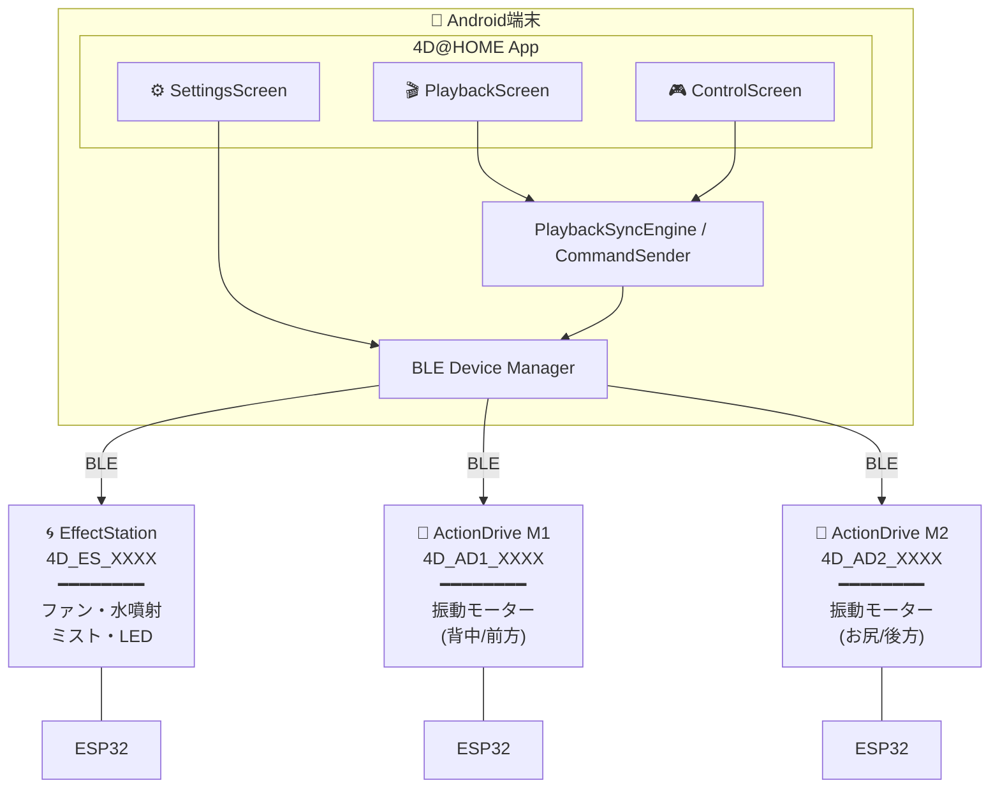
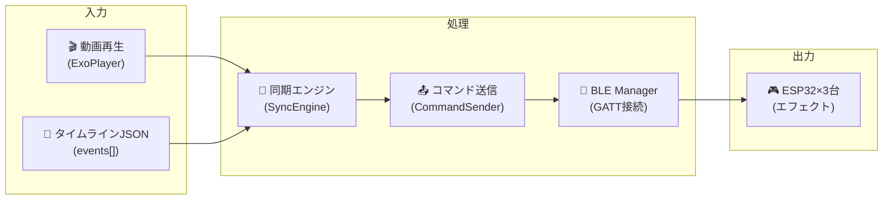

# 4D@HOME Android 詳細仕様書 - システム概要

**バージョン**: 1.0.0  
**作成日**: 2025年1月30日  
**対象システム**: 4D@HOME Android BLE制御版

---

## 📑 目次

1. [プロジェクト概要](#1-プロジェクト概要)
2. [システム構成](#2-システム構成)
3. [技術スタック一覧](#3-技術スタック一覧)
4. [仕様書構成](#4-仕様書構成)
5. [開発環境構築](#5-開発環境構築)

---

## 1. プロジェクト概要

### 1.1 製品コンセプト

**4D@HOME Android** は、家庭で4DX体験を再現するAndroidアプリケーションです。BLE（Bluetooth Low Energy）を使用してESP32デバイスと直接通信し、動画再生に同期したエフェクト（風、水、ミスト、LED照明、振動）を制御します。

### 1.2 Web版との違い

| 項目 | Web版 (JPHACKS 2025) | Android版 (本システム) |
|------|----------------------|------------------------|
| **通信方式** | WebSocket → Raspberry Pi → MQTT → ESP-12E | **BLE直接通信** → ESP32 |
| **マイコン** | ESP-12E (ESP8266) | **ESP32** |
| **デバイスハブ** | Raspberry Pi 3 Model B (必須) | **不要** |
| **インターネット** | 必要 (Cloud Run経由) | **不要 (完全ローカル)** |
| **同期方式** | 200ms間隔WebSocket同期 | **リアルタイムBLE (50ms先読み)** |
| **対応プラットフォーム** | Webブラウザ (React) | **Android 8.0+** |

### 1.3 対応エフェクト

| エフェクト | デバイス | 制御方式 |
|-----------|----------|----------|
| **ファン（風）** | EffectStation | ON/OFF デジタル制御 |
| **水噴射** | EffectStation | ワンショット (200ms) |
| **ミスト** | EffectStation | トグル式 (一瞬/継続) |
| **LED照明** | EffectStation | RGBW NeoPixel (12色 + エフェクト) |
| **振動 (背中)** | ActionDrive Motor1 | 4段階強度 + パターン |
| **振動 (お尻)** | ActionDrive Motor2 | 4段階強度 + パターン |

---

## 2. システム構成

### 2.1 物理構成図



### 2.2 ソフトウェアアーキテクチャ

```
app/src/main/java/com/wildcard/fourd_at_home/
├── FourdAtHomeApplication.kt    # Hilt Application
├── MainActivity.kt              # エントリーポイント
│
├── ble/                         # BLE通信レイヤー
│   ├── BleConstants.kt          # UUID/定数定義
│   ├── BleModels.kt             # データモデル
│   ├── BleScanner.kt            # デバイススキャン
│   ├── BleDeviceManager.kt      # 接続管理
│   └── CommandSender.kt         # コマンド送信
│
├── playback/                    # 再生同期レイヤー
│   ├── TimelineModels.kt        # タイムラインモデル
│   ├── TimelineParser.kt        # JSONパーサー
│   └── PlaybackSyncEngine.kt    # 同期エンジン
│
├── data/                        # データ永続化
│   └── SettingsRepository.kt    # DataStore設定
│
├── domain/                      # ドメイン層
│   └── Content.kt               # コンテンツモデル
│
├── di/                          # 依存性注入 (Hilt)
│   ├── BleModule.kt
│   ├── DataModule.kt
│   └── PlaybackModule.kt
│
└── ui/                          # UIレイヤー (Jetpack Compose)
    ├── navigation/
    │   └── AppNavigation.kt     # Navigation Rail
    ├── playback/
    │   ├── PlaybackScreen.kt
    │   └── PlaybackViewModel.kt
    ├── control/
    │   ├── ControlScreen.kt
    │   └── ControlViewModel.kt
    ├── settings/
    │   ├── SettingsScreen.kt
    │   └── SettingsViewModel.kt
    └── theme/
        ├── Color.kt
        ├── Theme.kt
        └── Type.kt
```

### 2.3 データフロー



---

## 3. 技術スタック一覧

### 3.1 Android アプリケーション

| カテゴリ | 技術 | バージョン | 用途 |
|---------|------|-----------|------|
| **言語** | Kotlin | 2.0.21 | メイン開発言語 |
| **UI** | Jetpack Compose | BOM 2024.12.01 | 宣言的UI |
| **デザインシステム** | Material Design 3 | - | テーマ・コンポーネント |
| **ナビゲーション** | Navigation Compose | 2.8.5 | 画面遷移 |
| **DI** | Hilt | 2.53.1 | 依存性注入 |
| **動画再生** | Media3 ExoPlayer | 1.5.1 | 動画プレイヤー |
| **非同期処理** | Kotlin Coroutines | 1.9.0 | 非同期処理・Flow |
| **永続化** | DataStore Preferences | 1.1.2 | 設定保存 |
| **シリアライズ** | kotlinx.serialization | 1.7.3 | JSONパース |
| **ビルドツール** | Gradle (Kotlin DSL) | 8.7.3 | ビルドシステム |
| **ビルドシステム** | KSP | 2.0.21-1.0.28 | アノテーション処理 |

### 3.2 ESP32 ファームウェア

| カテゴリ | 技術 | バージョン | 用途 |
|---------|------|-----------|------|
| **フレームワーク** | Arduino | - | ESP32プログラミング |
| **ビルドシステム** | PlatformIO | - | ビルド・書き込み |
| **プラットフォーム** | espressif32 | - | ESP32サポート |
| **BLEライブラリ** | ESP32 BLE Arduino | 内蔵 | BLE通信 |
| **LEDライブラリ** | Adafruit NeoPixel | 1.12.0 | RGBW LED制御 |

### 3.3 システム要件

#### Android端末
- **OS**: Android 8.0 (API 26) 以上
- **Bluetooth**: BLE (Bluetooth Low Energy) 対応必須
- **画面**: 横向き固定推奨 (SENSOR_LANDSCAPE)

#### ESP32
- **ボード**: ESP32 DevKit または互換ボード
- **フラッシュ**: 4MB以上
- **電源**: 3.3V / 5V

---

## 4. 仕様書構成

本システムの詳細仕様は以下の仕様書に分割されています：

| No. | ファイル名 | 内容 |
|-----|-----------|------|
| 00 | [SYSTEM_OVERVIEW.md](00_SYSTEM_OVERVIEW.md) | 本書: システム概要 |
| 01 | [ANDROID_ARCHITECTURE.md](01_ANDROID_ARCHITECTURE.md) | Androidアプリ アーキテクチャ仕様 |
| 02 | [BLE_COMMUNICATION.md](02_BLE_COMMUNICATION.md) | BLE通信プロトコル仕様 |
| 03 | [TIMELINE_FORMAT.md](03_TIMELINE_FORMAT.md) | タイムラインJSON仕様 |
| 04 | [ESP32_EFFECT_STATION.md](04_ESP32_EFFECT_STATION.md) | EffectStation ファームウェア仕様 |
| 05 | [ESP32_ACTION_DRIVE.md](05_ESP32_ACTION_DRIVE.md) | ActionDrive ファームウェア仕様 |
| 06 | [SYSTEM_INTEGRATION.md](06_SYSTEM_INTEGRATION.md) | システム統合仕様 |
| 07 | [UI_COMPONENTS.md](07_UI_COMPONENTS.md) | UIコンポーネント仕様 |
| 08 | [SETTINGS_DATA.md](08_SETTINGS_DATA.md) | 設定データ仕様 |

---

## 5. 開発環境構築

### 5.1 Android開発環境

```bash
# 必要なソフトウェア
- Android Studio Ladybug (2024.2.x) 以上
- JDK 11以上
- Android SDK 35

# プロジェクトのビルド
cd 4d-at-home-android
./gradlew assembleDebug
```

### 5.2 ESP32開発環境

```bash
# PlatformIO CLI インストール
pip install platformio

# EffectStation ビルド
cd esp32/effect_station
pio run

# ActionDrive Motor1 ビルド
cd esp32/action_drive_motor1
pio run

# ActionDrive Motor2 ビルド
cd esp32/action_drive_motor2
pio run
```

### 5.3 ファームウェア書き込み

```bash
# USBシリアル接続して書き込み
pio run --target upload

# シリアルモニター
pio device monitor --baud 115200
```

---

## 付録: ファイル一覧

### Androidアプリ主要ファイル

| ファイル | 行数 | 説明 |
|---------|------|------|
| `BleConstants.kt` | 38行 | BLE UUID定数 |
| `BleModels.kt` | 129行 | BLEデータモデル |
| `BleScanner.kt` | 235行 | BLEスキャナー |
| `BleDeviceManager.kt` | 616行 | BLE接続管理 |
| `CommandSender.kt` | 262行 | コマンド送信 |
| `TimelineModels.kt` | 163行 | タイムラインモデル |
| `TimelineParser.kt` | 170行 | JSONパーサー |
| `PlaybackSyncEngine.kt` | 605行 | 同期エンジン |
| `SettingsRepository.kt` | 220行 | 設定永続化 |

### ESP32ファームウェア

| ファイル | 行数 | 説明 |
|---------|------|------|
| `effect_station/main.cpp` | 391行 | EffectStation |
| `action_drive_motor1/main.cpp` | 308行 | Motor1 |
| `action_drive_motor2/main.cpp` | 308行 | Motor2 |
