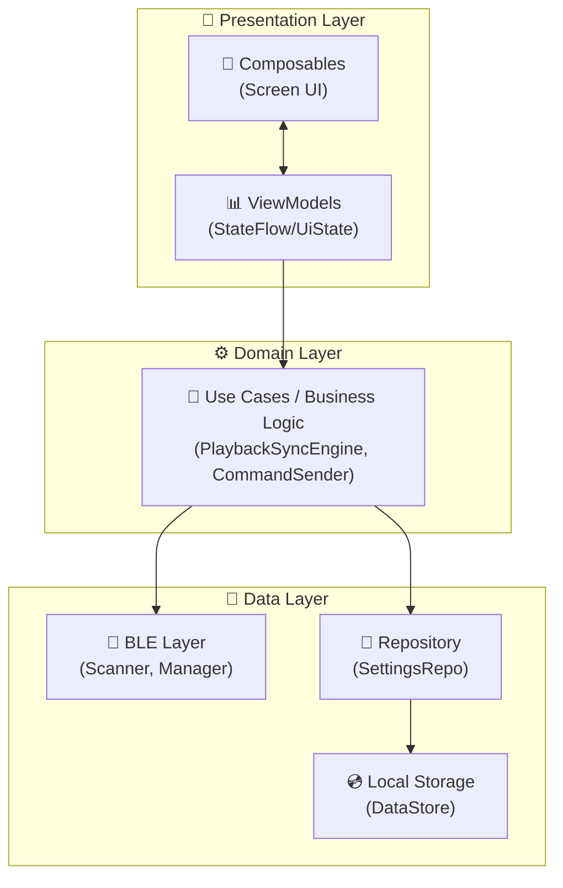

# 4D@HOME Android 詳細仕様書 - Androidアーキテクチャ仕様

**バージョン**: 1.0.0  
**作成日**: 2025年1月30日  
**対象**: Androidアプリケーション

---

## 📑 目次

1. [アーキテクチャ概要](#1-アーキテクチャ概要)
2. [レイヤー構成](#2-レイヤー構成)
3. [依存性注入 (Hilt)](#3-依存性注入-hilt)
4. [画面構成](#4-画面構成)
5. [状態管理](#5-状態管理)
6. [テーマ・デザインシステム](#6-テーマデザインシステム)
7. [ビルド設定](#7-ビルド設定)

---

## 1. アーキテクチャ概要

### 1.1 採用アーキテクチャ

**MVVM + Clean Architecture** を採用



### 1.2 パッケージ構成

```
com.wildcard.fourd_at_home/
│
├── FourdAtHomeApplication.kt    # @HiltAndroidApp
├── MainActivity.kt              # @AndroidEntryPoint
│
├── ble/                         # BLE通信（Data Layer）
│   ├── BleConstants.kt
│   ├── BleModels.kt
│   ├── BleScanner.kt
│   ├── BleDeviceManager.kt
│   └── CommandSender.kt
│
├── playback/                    # 再生同期（Domain Layer）
│   ├── TimelineModels.kt
│   ├── TimelineParser.kt
│   └── PlaybackSyncEngine.kt
│
├── data/                        # データ永続化（Data Layer）
│   └── SettingsRepository.kt
│
├── domain/                      # ドメインモデル
│   └── Content.kt
│
├── di/                          # 依存性注入モジュール
│   ├── BleModule.kt
│   ├── DataModule.kt
│   └── PlaybackModule.kt
│
└── ui/                          # Presentation Layer
    ├── navigation/
    ├── playback/
    ├── control/
    ├── settings/
    └── theme/
```

---

## 2. レイヤー構成

### 2.1 Presentation Layer

#### ファイル構成
```
ui/
├── navigation/
│   └── AppNavigation.kt         # Navigation Rail + NavHost
├── playback/
│   ├── PlaybackScreen.kt        # 再生画面UI
│   └── PlaybackViewModel.kt     # 再生画面ViewModel
├── control/
│   ├── ControlScreen.kt         # 制御画面UI
│   └── ControlViewModel.kt      # 制御画面ViewModel
├── settings/
│   ├── SettingsScreen.kt        # 設定画面UI
│   └── SettingsViewModel.kt     # 設定画面ViewModel
└── theme/
    ├── Color.kt                 # カラーパレット
    ├── Theme.kt                 # Material 3テーマ
    └── Type.kt                  # タイポグラフィ
```

#### AppNavigation.kt 詳細

```kotlin
// ルート定義
sealed class Screen(
    val route: String,
    val title: String,
    val selectedIcon: ImageVector,
    val unselectedIcon: ImageVector
) {
    data object Playback : Screen(
        route = "playback",
        title = "再生",
        selectedIcon = Icons.Filled.PlayArrow,
        unselectedIcon = Icons.Outlined.PlayArrow
    )
    data object Control : Screen(
        route = "control",
        title = "制御",
        selectedIcon = Icons.Filled.SportsEsports,
        unselectedIcon = Icons.Outlined.SportsEsports
    )
    data object Settings : Screen(
        route = "settings",
        title = "設定",
        selectedIcon = Icons.Filled.Settings,
        unselectedIcon = Icons.Outlined.Settings
    )
}

// 画面一覧
val screens = listOf(
    Screen.Playback,
    Screen.Control,
    Screen.Settings
)
```

**ナビゲーション構造**:
- `NavigationRail`: 横画面用のサイドナビゲーション
- `NavHost`: 各画面のComposeルーティング
- 開始画面: `Screen.Playback`

### 2.2 Domain Layer

#### PlaybackSyncEngine

```kotlin
@Singleton
class PlaybackSyncEngine @Inject constructor(
    private val commandSender: CommandSender
) {
    // 定数（250msイベント間隔に最適化）
    private const val LOOKAHEAD_MS = 200L           // 先読み時間
    private const val MIN_COMMAND_INTERVAL_MS = 20L // ESP32処理時間確保
    
    // 状態
    private val _state = MutableStateFlow(PlaybackSyncState())
    val state: StateFlow<PlaybackSyncState>
    
    private val _currentPositionMs = MutableStateFlow(0L)
    val currentPositionMs: StateFlow<Long>
    
    private val _currentCaption = MutableStateFlow(CurrentCaption())
    val currentCaption: StateFlow<CurrentCaption>
    
    // 主要メソッド
    fun loadTimeline(timelineFile: TimelineFile)
    fun start()
    fun pause()
    fun stop()
    fun updatePosition(positionMs: Long)
    fun onSeek(positionMs: Long)
}
```

**同期処理フロー**:
1. タイムラインJSONをロード
2. ExoPlayerから再生位置を受け取る（`updatePosition`）
3. 現在位置 + 200ms先までのイベントを抽出
4. STOP→START最適化を適用してBLE通信を削減
5. 異なるデバイスへは並列送信、同一デバイスへは20ms間隔で送信

#### CommandSender

```kotlin
@Singleton
class CommandSender @Inject constructor(
    private val deviceManager: BleDeviceManager
) {
    // 並列送信メソッド（250msイベント間隔対応）
    suspend fun sendCommandsParallel(commands: List<Pair<DeviceType, String>>): Result<Unit>
    suspend fun sendBothMotorsParallel(mode: String): Result<Unit>
    
    // EffectStation コマンド
    suspend fun sendFanCommand(on: Boolean): Result<Unit>
    suspend fun sendSplashCommand(): Result<Unit>
    suspend fun sendMistCommand(mode: Int): Result<Unit>
    suspend fun sendLedColorCommand(
        colorId: Int, 
        brightness: Int = 2, 
        effect: Int = 0, 
        transition: Int = 0
    ): Result<Unit>
    
    // ActionDrive コマンド
    suspend fun sendMotor1StringCommand(mode: String): Result<Unit>
    suspend fun sendMotor2StringCommand(mode: String): Result<Unit>
    suspend fun sendBothMotorsCommand(mode: String): Result<Unit>
    
    // 全停止
    suspend fun sendAllDevicesOff(): Result<Unit>
}
```

### 2.3 Data Layer

#### BleDeviceManager

```kotlin
@Singleton
class BleDeviceManager @Inject constructor(
    @ApplicationContext private val context: Context
) {
    // 状態
    val connections: StateFlow<Map<String, BleConnection>>
    val statusNotifications: SharedFlow<StatusNotification>
    val commandLog: StateFlow<List<CommandLogEntry>>
    
    // 接続管理
    suspend fun connect(device: ScannedDevice): Result<Unit>
    fun disconnect(address: String)
    fun disconnectAll()
    
    // コマンド送信
    suspend fun sendCommand(address: String, command: ByteArray): Result<Unit>
    
    // ユーティリティ
    fun getReadyDevices(): List<BleConnection>
    fun getDeviceByType(type: DeviceType): BleConnection?
}
```

#### SettingsRepository

```kotlin
@Singleton
class SettingsRepository @Inject constructor(
    @ApplicationContext private val context: Context
) {
    // PreferencesキーDefaults
    companion object {
        const val DEFAULT_RECONNECT_ATTEMPTS = 3
        const val DEFAULT_SYNC_OFFSET_MS = 0L
        const val DEFAULT_MASTER_INTENSITY = 100
        const val DEFAULT_SAFETY_TIMEOUT_SECONDS = 30
    }
    
    // 接続設定
    val autoReconnect: Flow<Boolean>
    val reconnectAttempts: Flow<Int>
    val savedDeviceAddresses: Flow<Set<String>>
    
    // 再生設定
    val syncOffsetMs: Flow<Long>
    val autoPlay: Flow<Boolean>
    val lastVideoUri: Flow<String?>
    val lastTimelineUri: Flow<String?>
    
    // エフェクト設定
    val masterIntensity: Flow<Int>
    val fanEnabled: Flow<Boolean>
    val waterEnabled: Flow<Boolean>
    val mistEnabled: Flow<Boolean>
    val ledEnabled: Flow<Boolean>
    val vibrationEnabled: Flow<Boolean>
    
    // 安全設定
    val safetyTimeoutEnabled: Flow<Boolean>
    val safetyTimeoutSeconds: Flow<Int>
}
```

---

## 3. 依存性注入 (Hilt)

### 3.1 アプリケーションクラス

```kotlin
// FourdAtHomeApplication.kt
@HiltAndroidApp
class FourdAtHomeApplication : Application()
```

### 3.2 Activityクラス

```kotlin
// MainActivity.kt
@AndroidEntryPoint
class MainActivity : ComponentActivity() {
    override fun onCreate(savedInstanceState: Bundle?) {
        super.onCreate(savedInstanceState)
        enableEdgeToEdge()
        
        setContent {
            FourdAtHomeTheme {
                Surface(modifier = Modifier.fillMaxSize()) {
                    AppNavigation()
                }
            }
        }
    }
}
```

### 3.3 DIモジュール

#### BleModule.kt

```kotlin
@Module
@InstallIn(SingletonComponent::class)
object BleModule {
    // BleScanner と BleDeviceManager は @Inject constructor で自動提供
    // 追加の提供が必要な場合のみここに記述
}
```

#### DataModule.kt

```kotlin
@Module
@InstallIn(SingletonComponent::class)
object DataModule {
    // SettingsRepository は @Inject constructor で自動提供
}
```

#### PlaybackModule.kt

```kotlin
@Module
@InstallIn(SingletonComponent::class)
object PlaybackModule {
    // TimelineParser と PlaybackSyncEngine は @Inject constructor で自動提供
}
```

### 3.4 Singletonスコープ

以下のクラスは`@Singleton`スコープで提供：

| クラス | 理由 |
|--------|------|
| `BleScanner` | スキャン状態をアプリ全体で共有 |
| `BleDeviceManager` | BLE接続をアプリ全体で管理 |
| `CommandSender` | デバイスマネージャーに依存 |
| `TimelineParser` | JSONパース機能 |
| `PlaybackSyncEngine` | 再生同期状態を管理 |
| `SettingsRepository` | DataStore設定を管理 |

---

## 4. 画面構成

### 4.1 画面遷移図

```
┌─────────────────────────────────────────────────────────────┐
│                     Navigation Rail                          │
│  ┌─────────┐  ┌─────────┐  ┌─────────┐                      │
│  │  再生   │  │  制御   │  │  設定   │                      │
│  │ Screen  │  │ Screen  │  │ Screen  │                      │
│  └────┬────┘  └────┬────┘  └────┬────┘                      │
│       │            │            │                            │
│       ▼            ▼            ▼                            │
│ ┌──────────────────────────────────────────────────────┐    │
│ │                   Content Area                        │    │
│ │                                                       │    │
│ │  PlaybackScreen │ ControlScreen │ SettingsScreen     │    │
│ │                                                       │    │
│ └──────────────────────────────────────────────────────┘    │
└─────────────────────────────────────────────────────────────┘
```

### 4.2 PlaybackScreen（再生画面）

**目的**: 動画再生とタイムライン同期エフェクト再生

**機能**:
- 動画選択（ファイルピッカー）
- タイムラインJSON選択
- ExoPlayerによる動画再生
- 再生位置に同期したエフェクト発火
- キャプション表示
- 同期状態モニター

**ViewModel状態**:
```kotlin
data class PlaybackUiState(
    // コンテンツ状態
    val availableContents: List<Content> = ContentLibrary.contents,
    val selectedContent: Content? = null,
    
    // ビデオ状態
    val videoUri: Uri? = null,
    val videoTitle: String = "",
    val isVideoLoaded: Boolean = false,
    
    // タイムライン状態
    val timelineState: PlaybackSyncState = PlaybackSyncState(),
    
    // 再生状態
    val isPlaying: Boolean = false,
    val currentPosition: Long = 0,
    val duration: Long = 0,
    val bufferedPosition: Long = 0,
    
    // 接続状態
    val isEffectStationConnected: Boolean = false,
    val isMotor1Connected: Boolean = false,
    val isMotor2Connected: Boolean = false,
    
    // その他
    val error: String? = null,
    val showContentSelector: Boolean = true
)
```

### 4.3 ControlScreen（制御画面）

**目的**: 手動エフェクト制御とデバッグ

**機能**:
- エフェクトごとの手動トリガーボタン
- 強度スライダー
- モード切替（Momentary / Trigger）
- 通信ログコンソール（リアルタイム表示）
- ログクリア・一時停止

**ViewModel状態**:
```kotlin
data class EffectState(
    // EffectStation
    val fanOn: Boolean = false,
    val mistMode: MistMode = MistMode.OFF,
    val ledColor: LedColorPreset = LedColorPreset.OFF,
    val ledBrightness: LedBrightnessLevel = LedBrightnessLevel.OFF,
    val ledEffect: LedEffectMode = LedEffectMode.STEADY,
    val ledTransition: LedTransitionMode = LedTransitionMode.INSTANT,
    // ActionDrive
    val motor1Level: VibrationLevel = VibrationLevel.OFF,
    val motor2Level: VibrationLevel = VibrationLevel.OFF
)

data class ControlUiState(
    val effectState: EffectState = EffectState(),
    val isEffectStationConnected: Boolean = false,
    val isMotor1Connected: Boolean = false,
    val isMotor2Connected: Boolean = false,
    val lastError: String? = null,
    val isSending: Boolean = false
)
```

### 4.4 SettingsScreen（設定画面）

**目的**: BLEデバイス管理と接続設定

**機能**:
- BLEスキャン開始/停止
- デバイス一覧表示（名前、アドレス、RSSI）
- デバイス接続/切断
- 接続状態表示
- 自動再接続設定

**ViewModel状態**:
```kotlin
data class SettingsUiState(
    val scanState: ScanState = ScanState.IDLE,
    val scannedDevices: List<ScannedDevice> = emptyList(),
    val connections: Map<String, BleConnection> = emptyMap(),
    val commandLog: List<CommandLogEntry> = emptyList(),
    val error: BleError? = null,
    val showPermissionDialog: Boolean = false,
    val requiredPermissions: List<String> = emptyList(),
    val bluetoothEnabled: Boolean = true
)
```

---

## 5. 状態管理

### 5.1 StateFlow パターン

すべてのViewModelは`StateFlow`を使用して状態を公開：

```kotlin
class ExampleViewModel @Inject constructor() : ViewModel() {
    private val _uiState = MutableStateFlow(ExampleUiState())
    val uiState: StateFlow<ExampleUiState> = _uiState.asStateFlow()
    
    fun updateSomething(value: String) {
        _uiState.value = _uiState.value.copy(someField = value)
    }
}
```

### 5.2 Composeでの購読

```kotlin
@Composable
fun ExampleScreen(viewModel: ExampleViewModel = hiltViewModel()) {
    val uiState by viewModel.uiState.collectAsState()
    
    // UI構築
}
```

### 5.3 SharedFlow パターン

一時的なイベント（ステータス通知など）には`SharedFlow`を使用：

```kotlin
private val _statusNotifications = MutableSharedFlow<StatusNotification>()
val statusNotifications: SharedFlow<StatusNotification> = _statusNotifications.asSharedFlow()
```

---

## 6. テーマ・デザインシステム

### 6.1 カラーパレット（Color.kt）

```kotlin
// 基本カラー
val DeepBlack = Color(0xFF050505)      // 背景色 (Main)
val DarkGrey = Color(0xFF1E1E1E)       // 背景色 (Surface)
val NeonRed = Color(0xFFFF0033)        // ブランドカラー
val PureWhite = Color(0xFFFFFFFF)      // テキスト (Main)
val LightGrey = Color(0xFFB3B3B3)      // テキスト (Sub)

// エフェクトカラー
val EffectOrange = Color(0xFFD97706)   // 衝撃・振動
val EffectCyan = Color(0xFF06B6D4)     // 水
val EffectGreen = Color(0xFF10B981)    // 風
val EffectWhite = Color(0xFFF3F4F6)    // 光

// 状態カラー
val StatusConnected = Color(0xFF22C55E)     // 接続済み
val StatusDisconnected = Color(0xFFEF4444)  // 未接続
val StatusConnecting = Color(0xFFFACC15)    // 接続中
```

### 6.2 テーマ設定（Theme.kt）

```kotlin
private val DarkColorScheme = darkColorScheme(
    primary = NeonRed,
    onPrimary = PureWhite,
    background = DeepBlack,
    surface = DarkGrey,
    onSurface = PureWhite,
    // ... その他
)

@Composable
fun FourdAtHomeTheme(content: @Composable () -> Unit) {
    val colorScheme = DarkColorScheme
    
    MaterialTheme(
        colorScheme = colorScheme,
        typography = Typography,
        content = content
    )
}
```

### 6.3 デザインコンセプト

**「Pocket Theater / Dark Immersion」**

- 完全ダークモードベース
- 有機EL最適化（真黒に近い背景）
- ブランドカラー（赤）はアクセントのみ
- 角丸: 12dp〜16dp（親しみやすさ）

---

## 7. ビルド設定

### 7.1 build.gradle.kts (app)

```kotlin
plugins {
    alias(libs.plugins.android.application)
    alias(libs.plugins.kotlin.android)
    alias(libs.plugins.kotlin.compose)
    alias(libs.plugins.hilt.android)
    alias(libs.plugins.kotlin.serialization)
    alias(libs.plugins.ksp)
}

android {
    namespace = "com.wildcard.fourd_at_home"
    compileSdk = 35

    defaultConfig {
        applicationId = "com.wildcard.fourd_at_home"
        minSdk = 26
        targetSdk = 35
        versionCode = 1
        versionName = "1.0.0"
    }

    buildFeatures {
        compose = true
    }

    compileOptions {
        sourceCompatibility = JavaVersion.VERSION_11
        targetCompatibility = JavaVersion.VERSION_11
    }

    kotlinOptions {
        jvmTarget = "11"
    }
}
```

### 7.2 依存関係（libs.versions.toml）

| ライブラリ | バージョン |
|-----------|-----------|
| AGP | 8.7.3 |
| Kotlin | 2.0.21 |
| Compose BOM | 2024.12.01 |
| Navigation Compose | 2.8.5 |
| Hilt | 2.53.1 |
| Media3 | 1.5.1 |
| Coroutines | 1.9.0 |
| DataStore | 1.1.2 |
| kotlinx.serialization | 1.7.3 |
| KSP | 2.0.21-1.0.28 |

### 7.3 必要なパーミッション

```xml
<!-- AndroidManifest.xml -->
<uses-permission android:name="android.permission.BLUETOOTH" />
<uses-permission android:name="android.permission.BLUETOOTH_ADMIN" />
<uses-permission android:name="android.permission.BLUETOOTH_SCAN" />
<uses-permission android:name="android.permission.BLUETOOTH_CONNECT" />
<uses-permission android:name="android.permission.ACCESS_FINE_LOCATION" />
<uses-permission android:name="android.permission.ACCESS_COARSE_LOCATION" />

<uses-feature android:name="android.hardware.bluetooth_le" android:required="true" />
```
