# 4D@HOME Android 詳細仕様書 - タイムラインJSON仕様

**バージョン**: 1.0.0  
**作成日**: 2025年1月30日  
**対象**: タイムライン同期システム

---

## 📑 目次

1. [概要](#1-概要)
2. [ファイル構造](#2-ファイル構造)
3. [イベントタイプ](#3-イベントタイプ)
4. [エフェクト定義](#4-エフェクト定義)
5. [モード詳細](#5-モード詳細)
6. [サンプルタイムライン](#6-サンプルタイムライン)
7. [パース処理](#7-パース処理)
8. [同期エンジン](#8-同期エンジン)
9. [Web版との互換性](#9-web版との互換性)

---

## 1. 概要

### 1.1 タイムラインとは

タイムラインJSONは、動画の再生時間に同期してトリガーするエフェクトイベントを定義したデータファイルです。

```
動画再生: [========================================]
           0s    5s    10s   15s   20s   25s   30s

タイムライン:
          [風ON]     [水噴射]      [振動停止]
               [LED赤]      [LED青]    [全停止]
```

### 1.2 データフロー

```mermaid
flowchart LR
    subgraph Input["📁 入力"]
        File["📄 timeline.json<br/>(ファイル)"]
    end
    
    subgraph Parse["🔧 解析"]
        Parser["TimelineParser<br/>(パース)"]
        Model["TimelineFile<br/>(データモデル)"]
    end
    
    subgraph Sync["⚡ 同期"]
        Player["ExoPlayer<br/>(現在位置)"]
        Engine["PlaybackSync<br/>Engine"]
        Events["ScheduledEvent<br/>(実行予定)"]
    end
    
    subgraph Output["📤 出力"]
        Sender["CommandSender<br/>(BLE送信)"]
    end
    
    File --> Parser
    Parser --> Model
    Model --> Engine
    Player --> Engine
    Events --> Engine
    Engine --> Sender
```



---

## 2. ファイル構造

### 2.1 基本構造

```json
{
  "events": [
    {
      "t": 0.0,
      "action": "caption",
      "text": "シーンの説明文"
    },
    {
      "t": 0.0,
      "action": "start",
      "effect": "vibration",
      "mode": "down_weak"
    },
    {
      "t": 5.0,
      "action": "stop",
      "effect": "vibration",
      "mode": "down_weak"
    }
  ]
}
```

### 2.2 フィールド定義

| フィールド | 型 | 必須 | 説明 |
|-----------|-----|------|------|
| `events` | Array | ✓ | イベントの配列 |

### 2.3 イベントフィールド

| フィールド | 型 | 必須 | 説明 |
|-----------|-----|------|------|
| `t` | Double | ✓ | 時刻（秒） |
| `action` | String | ✓ | アクションタイプ |
| `effect` | String | △ | エフェクトタイプ（action≠captionの場合必須） |
| `mode` | String | △ | モード（action≠captionの場合必須） |
| `text` | String | △ | キャプションテキスト（action=captionの場合必須） |

### 2.4 Kotlinデータモデル

```kotlin
@Serializable
data class TimelineFile(
    val events: List<TimelineEventData> = emptyList()
)

@Serializable
data class TimelineEventData(
    val t: Double,                    // 時刻（秒）
    val action: EventAction,          // start/stop/shot/caption
    val effect: EffectType? = null,   // 効果タイプ
    val mode: String? = null,         // モード
    val text: String? = null          // キャプション用
)
```

---

## 3. イベントタイプ

### 3.1 action一覧

| action | 説明 | 必須フィールド |
|--------|------|---------------|
| `caption` | キャプション表示 | `t`, `text` |
| `start` | エフェクト開始 | `t`, `effect`, `mode` |
| `stop` | エフェクト停止 | `t`, `effect`, `mode` |
| `shot` | ワンショット発火 | `t`, `effect`, `mode` |

### 3.2 caption（キャプション）

シーンの説明文を表示します。

```json
{
  "t": 0.0,
  "action": "caption",
  "text": "車を運転中の男性が、無線機に向かって「急げ！」と指示を出している。"
}
```

### 3.3 start（エフェクト開始）

エフェクトを開始します。対応する`stop`イベントまで継続します。

```json
{
  "t": 0.0,
  "action": "start",
  "effect": "vibration",
  "mode": "down_weak"
}
```

### 3.4 stop（エフェクト停止）

開始されたエフェクトを停止します。

```json
{
  "t": 5.0,
  "action": "stop",
  "effect": "vibration",
  "mode": "down_weak"
}
```

**重要**: `start`と`stop`はペアで使用してください。

### 3.5 shot（ワンショット）

一度だけ発火するエフェクトです。主に水噴射で使用します。

```json
{
  "t": 3.0,
  "action": "shot",
  "effect": "water",
  "mode": "burst"
}
```

---

## 4. エフェクト定義

### 4.1 effect一覧

| effect | 対象デバイス | 説明 |
|--------|-------------|------|
| `vibration` | ActionDrive | 振動 |
| `flash` | EffectStation | フラッシュ（白色LED） |
| `color` | EffectStation | カラーLED |
| `water` | EffectStation | 水噴射 |
| `wind` | EffectStation | ファン（風） |
| `mist` | EffectStation | ミスト |

### 4.2 Kotlin Enum定義

```kotlin
@Serializable
enum class EffectType {
    @SerialName("vibration") VIBRATION,
    @SerialName("flash") FLASH,
    @SerialName("color") COLOR,
    @SerialName("water") WATER,
    @SerialName("wind") WIND,
    @SerialName("mist") MIST
}

@Serializable
enum class EventAction {
    @SerialName("start") START,
    @SerialName("stop") STOP,
    @SerialName("shot") SHOT,
    @SerialName("caption") CAPTION
}
```

---

## 5. モード詳細

### 5.1 vibration（振動）モード

#### 上（背中）のみ - Motor1

| mode | JSON値 | 強度 | ESP32コマンド |
|------|--------|------|--------------|
| 上弱 | `up_weak` | 64 | `WEAK` |
| 上中弱 | `up_mid_weak` | 128 | `MEDIUM_WEAK` |
| 上中強 | `up_mid_strong` | 192 | `MEDIUM_STRONG` |
| 上強 | `up_strong` | 255 | `STRONG` |

#### 下（お尻）のみ - Motor2

| mode | JSON値 | 強度 | ESP32コマンド |
|------|--------|------|--------------|
| 下弱 | `down_weak` | 64 | `WEAK` |
| 下中弱 | `down_mid_weak` | 128 | `MEDIUM_WEAK` |
| 下中強 | `down_mid_strong` | 192 | `MEDIUM_STRONG` |
| 下強 | `down_strong` | 255 | `STRONG` |

#### 上下同時 - 両Motor

| mode | JSON値 | 強度 | ESP32コマンド |
|------|--------|------|--------------|
| 上下弱 | `up_down_weak` | 64 | `WEAK` |
| 上下中弱 | `up_down_mid_weak` | 128 | `MEDIUM_WEAK` |
| 上下中強 | `up_down_mid_strong` | 192 | `MEDIUM_STRONG` |
| 上下強 | `up_down_strong` | 255 | `STRONG` |

#### 特殊パターン

| mode | JSON値 | 説明 |
|------|--------|------|
| 心拍 | `heartbeat` | ドッ..クン...のリズム |

### 5.2 flash（フラッシュ）モード

| mode | JSON値 | LEDエフェクト | 説明 |
|------|--------|--------------|------|
| 点灯 | `steady` | 0 | 継続的な光 |
| 点滅 | `blink` | 1 | 通常の点滅 |
| 遅い点滅 | `slow_blink` | 1 | 互換用（blinkと同じ） |
| 速い点滅 | `fast_blink` | 1 | 互換用（blinkと同じ） |
| 呼吸 | `breathe` | 2 | 徐々に明滅 |

### 5.3 color（カラー）モード

| mode | JSON値 | colorId | RGB値 |
|------|--------|---------|-------|
| ピンク | `pink` | 0 | (255, 20, 100) |
| 赤 | `red` | 1 | (255, 0, 0) |
| オレンジ | `orange` | 2 | (255, 100, 0) |
| 黄色 | `yellow` | 3 | (255, 255, 0) |
| 黄緑 | `yellow_green` | 4 | (150, 255, 0) |
| 緑 | `green` | 5 | (0, 255, 0) |
| 深緑 | `dark_green` | 6 | (0, 100, 0) |
| シアン | `cyan` | 7 | (0, 255, 255) |
| 青 | `blue` | 8 | (0, 0, 255) |
| 紫 | `purple` | 9 | (150, 0, 255) |
| 白 | `white` | 10 | Wチャンネル |
| 消灯 | `off` | 11 | (0, 0, 0) |

### 5.4 LED優先度制御（color/flash）

EffectStationには1つのLED（GPIO 27）しかないため、`color`と`flash`が同時に指定された場合の優先度制御が必要です。

#### 優先度ルール

| 状況 | 動作 |
|------|------|
| `color` START中に `flash` START | **flash抑制**: colorを維持 |
| `color` START中に `flash` STOP | **flash抑制**: colorを維持 |
| `color` STOP後に `flash` 処理 | flashが正常に動作 |

#### タイムライン例

```
時間軸: ──────────────────────────────────────────▶
         
color:   ───[START:orange]═══════════[STOP]───────
flash:        [START:steady]──(抑制)──[STOP]
                     ↑                   ↑
              コマンド送信されない   コマンド送信されない
```

#### 実装詳細

`PlaybackSyncEngine`内で`isColorActive`フラグにより管理：

```kotlin
// colorがアクティブな間はflashを抑制
private var isColorActive = false

// COLOR START時: isColorActive = true
// COLOR STOP時: isColorActive = false
// FLASH START/STOP時: isColorActiveがtrueならスキップ
```

### 5.5 water/wind/mist モード

| effect | mode | ESP32コマンド | 説明 |
|--------|------|--------------|------|
| water | `burst` | `SPLASH` | 水噫射（ワンショット、shot専用） |
| wind | `burst` | `FAN,1` | ファンON |
| mist | `burst` | `MIST,1` | ミスト噫射（一瞬、自動OFF） |
| mist | `stream` | `MIST,2` | ミスト噫射（継続、stopまで継続） |

#### mistモード詳細

| mode | JSON値 | MISTコマンド | 使用アクション | 説明 |
|------|--------|---------------|----------------|------|
| 一瞬 | `burst` | `MIST,1` | `shot` | 短時間噫射後自動停止 |
| 継続 | `stream` | `MIST,2` | `start`/`stop` | stopイベントまで継続 |
| 停止 | - | `MIST,0` | `stop` | ミスト停止 |

---

## 6. サンプルタイムライン

### 6.1 完全なサンプル

```json
{
  "events": [
    {
      "t": 0.0,
      "action": "caption",
      "text": "映画開始 - 夜の街を車が走っている"
    },
    {
      "t": 0.0,
      "action": "start",
      "effect": "color",
      "mode": "blue"
    },
    {
      "t": 2.0,
      "action": "start",
      "effect": "vibration",
      "mode": "down_weak"
    },
    {
      "t": 5.0,
      "action": "caption",
      "text": "雨が降り始める"
    },
    {
      "t": 5.0,
      "action": "start",
      "effect": "wind",
      "mode": "burst"
    },
    {
      "t": 5.5,
      "action": "shot",
      "effect": "water",
      "mode": "burst"
    },
    {
      "t": 8.0,
      "action": "stop",
      "effect": "vibration",
      "mode": "down_weak"
    },
    {
      "t": 8.0,
      "action": "start",
      "effect": "vibration",
      "mode": "up_down_strong"
    },
    {
      "t": 8.0,
      "action": "caption",
      "text": "突然の衝突！"
    },
    {
      "t": 8.0,
      "action": "start",
      "effect": "flash",
      "mode": "fast_blink"
    },
    {
      "t": 8.5,
      "action": "stop",
      "effect": "flash",
      "mode": "fast_blink"
    },
    {
      "t": 10.0,
      "action": "stop",
      "effect": "vibration",
      "mode": "up_down_strong"
    },
    {
      "t": 10.0,
      "action": "stop",
      "effect": "wind",
      "mode": "burst"
    },
    {
      "t": 12.0,
      "action": "start",
      "effect": "color",
      "mode": "red"
    },
    {
      "t": 15.0,
      "action": "stop",
      "effect": "color",
      "mode": "red"
    },
    {
      "t": 15.0,
      "action": "stop",
      "effect": "color",
      "mode": "blue"
    },
    {
      "t": 15.0,
      "action": "caption",
      "text": "シーン終了"
    }
  ]
}
```

### 6.2 Kotlinでのサンプル生成

```kotlin
fun createSampleTimeline(): TimelineFile {
    return TimelineFile(
        events = listOf(
            TimelineEventData(
                t = 0.0, 
                action = EventAction.CAPTION, 
                text = "サンプル開始"
            ),
            TimelineEventData(
                t = 0.0, 
                action = EventAction.START, 
                effect = EffectType.COLOR, 
                mode = "green"
            ),
            TimelineEventData(
                t = 2.0, 
                action = EventAction.START, 
                effect = EffectType.WIND, 
                mode = "burst"
            ),
            TimelineEventData(
                t = 5.0, 
                action = EventAction.START, 
                effect = EffectType.VIBRATION, 
                mode = "up_down_mid_strong"
            ),
            TimelineEventData(
                t = 8.0, 
                action = EventAction.SHOT, 
                effect = EffectType.WATER, 
                mode = "burst"
            ),
            // ... 続き
        )
    )
}
```

---

## 7. パース処理

### 7.1 TimelineParser

```kotlin
@Singleton
class TimelineParser @Inject constructor(
    @ApplicationContext private val context: Context
) {
    private val json = Json {
        ignoreUnknownKeys = true    // 未知のキーを無視
        isLenient = true            // 緩やかなパース
        coerceInputValues = true    // 型強制
    }

    // URIからパース
    fun parseFromUri(uri: Uri): Result<TimelineFile>
    
    // Assetsからパース
    fun parseFromAssets(fileName: String): Result<TimelineFile>
    
    // 文字列からパース
    fun parseFromString(jsonString: String): Result<TimelineFile>
    
    // 検証
    fun validate(timeline: TimelineFile): List<String>
    
    // 最大時刻取得（ミリ秒）
    fun getMaxDuration(timeline: TimelineFile): Long
}
```

### 7.2 検証ルール

```kotlin
fun validate(timeline: TimelineFile): List<String> {
    val errors = mutableListOf<String>()
    
    // 1. イベント存在チェック
    if (timeline.events.isEmpty()) {
        errors.add("イベントがありません")
    }
    
    var lastTime = -1.0
    timeline.events.forEachIndexed { index, event ->
        // 2. 時刻チェック（負の値）
        if (event.t < 0) {
            errors.add("イベント$index: 時刻が負の値です")
        }
        
        // 3. 時刻順序チェック（警告）
        if (event.t < lastTime) {
            errors.add("イベント$index: 時刻が順序通りでありません")
        }
        lastTime = event.t
        
        // 4. アクション別検証
        when (event.action) {
            EventAction.CAPTION -> {
                if (event.text.isNullOrBlank()) {
                    errors.add("イベント$index: captionにtextがありません")
                }
            }
            else -> {
                if (event.effect == null) {
                    errors.add("イベント$index: effectが指定されていません")
                }
                if (event.mode == null) {
                    errors.add("イベント$index: modeが指定されていません")
                }
            }
        }
    }
    
    return errors
}
```

---

## 8. 同期エンジン

### 8.1 PlaybackSyncEngine概要

```kotlin
@Singleton
class PlaybackSyncEngine @Inject constructor(
    private val commandSender: CommandSender
) {
    companion object {
        private const val TAG = "PlaybackSyncEngine"
        // 250ms間隔のイベントに対応するため、200ms先読み
        // これによりBLE通信遅延(約50-100ms)を考慮して余裕を持って送信
        private const val LOOKAHEAD_MS = 200L
        // コマンド間の最小間隔（ESP32の処理時間を考慮）
        private const val MIN_COMMAND_INTERVAL_MS = 20L
    }
    
    private var timeline: TimelineFile? = null
    private var scheduledEvents: MutableList<ScheduledEvent> = mutableListOf()
    private val activeEffects = mutableMapOf<String, TimelineEventData>()
}
```

### 8.2 同期処理フロー

```
1. loadTimeline() - JSONをロード
   ├─ TimelineFile を受け取る
   ├─ 秒→ミリ秒に変換
   └─ ScheduledEvent リストを作成

2. start() - 再生開始
   └─ isPlaying = true

3. updatePosition(positionMs) - ExoPlayerから呼び出し
   ├─ 現在位置 + 200ms までのイベントを抽出
   ├─ 未実行イベントをフィルタ
   ├─ STOP→START最適化を適用
   └─ executeEvent() を呼び出し

4. executeEvent(event) - イベント実行
   ├─ CAPTION → キャプション更新
   ├─ START → executeEffectStart()
   ├─ STOP → executeEffectStop()
   └─ SHOT → executeEffectShot()
```

### 8.3 エフェクト→コマンド変換

```kotlin
private suspend fun executeEffectStart(effect: EffectType, mode: String) {
    when (effect) {
        EffectType.WIND -> {
            commandSender.sendFanCommand(true)
        }
        EffectType.MIST -> {
            commandSender.sendMistCommand(2)  // 継続モード
        }
        EffectType.COLOR -> {
            ColorMode.fromJsonMode(mode)?.let { colorMode ->
                commandSender.sendLedColorCommand(
                    colorId = colorMode.ledColorId,
                    brightness = 2,
                    effect = 0,
                    transition = 0
                )
            }
        }
        EffectType.FLASH -> {
            FlashMode.fromJsonMode(mode)?.let { flashMode ->
                commandSender.sendLedColorCommand(
                    colorId = 10,  // 白
                    brightness = 2,
                    effect = flashMode.ledEffect,
                    transition = 0
                )
            }
        }
        EffectType.VIBRATION -> {
            VibrationMode.fromJsonMode(mode)?.let { vibMode ->
                val command = vibMode.esp32Command
                when (vibMode.target) {
                    MotorTarget.MOTOR_1 -> 
                        commandSender.sendMotor1StringCommand(command)
                    MotorTarget.MOTOR_2 -> 
                        commandSender.sendMotor2StringCommand(command)
                    MotorTarget.BOTH -> {
                        // 並列送信で両モーターに同時にコマンドを送信
                        commandSender.sendBothMotorsParallel(command)
                    }
                }
            }
        }
        EffectType.WATER -> { /* shotのみ */ }
    }
}
```

### 8.4 STOP→START最適化

同じ時刻に同じエフェクトのSTOPとSTARTがある場合、STOPをスキップしてBLE通信を削減します。

```kotlin
/**
 * 同じ時刻で同じエフェクトのSTOP→STARTがある場合、STOPをスキップする最適化
 * これによりBLE通信回数を減らし、デバイス側でのタイミング問題を回避する
 */
private fun optimizeStopStartEvents(
    sortedEvents: List<ScheduledEvent>
): List<Pair<ScheduledEvent, Boolean>>
```

### 8.5 シーク処理

```kotlin
fun onSeek(positionMs: Long) {
    _currentPositionMs.value = positionMs
    
    // シーク位置より前のイベントは実行済みにマーク
    scheduledEvents.forEach { scheduled ->
        scheduled.executed = scheduled.timestampMs < positionMs
    }
    
    // 現在位置のエフェクト状態を復元
    restoreStateAtPosition(positionMs)
}
```

---

## 9. Web版との互換性

### 9.1 共通仕様

Android版はWeb版（JPHACKS 2025）のタイムラインJSON仕様と**完全互換**です。

| 項目 | Web版 | Android版 |
|------|-------|-----------|
| ファイル形式 | JSON | JSON |
| 時刻単位 | 秒 (Double) | 秒 (Double) |
| action | start/stop/shot/caption | 同一 |
| effect | vibration/flash/color/water/wind | 同一 + mist |
| 振動mode | 12種類 | 13種類（heartbeat追加） |
| 色mode | 6色 | 12色（拡張） |

### 9.2 拡張された機能

**Android版で追加されたmode**:

- `mist` エフェクト
- `heartbeat` 振動パターン
- 12色対応（Web版は6色）

### 9.3 Web版JSONの読み込み

Web版で作成されたタイムラインJSONはそのままAndroid版で使用可能です。

```kotlin
// Web版JSONをそのまま読み込み可能
val timeline = timelineParser.parseFromAssets("web_timeline.json")
```
