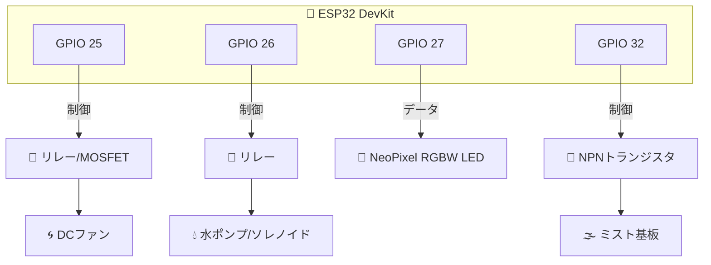
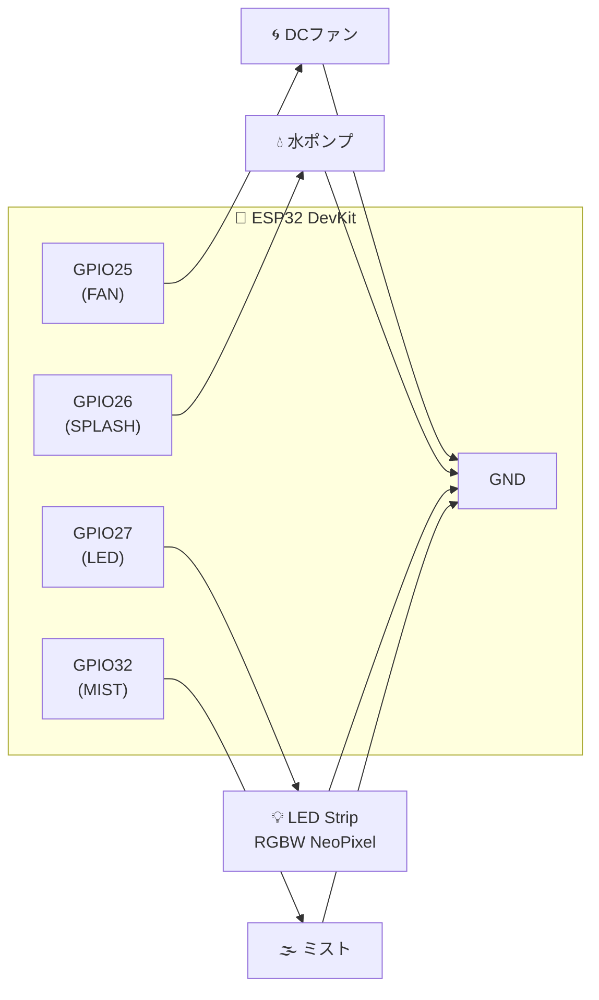

# 4D@HOME Android 詳細仕様書 - ESP32 EffectStation ファームウェア仕様

**バージョン**: 1.0.0  
**作成日**: 2025年1月30日  
**対象**: EffectStation (4D_ES_XXXX)

---

## 📑 目次

1. [概要](#1-概要)
2. [ハードウェア構成](#2-ハードウェア構成)
3. [ピン定義](#3-ピン定義)
4. [BLE設定](#4-ble設定)
5. [コマンド処理](#5-コマンド処理)
6. [エフェクト制御](#6-エフェクト制御)
7. [LED制御](#7-led制御)
8. [ステータス通知](#8-ステータス通知)
9. [ビルド設定](#9-ビルド設定)
10. [ソースコード解説](#10-ソースコード解説)

---

## 1. 概要

### 1.1 EffectStationとは

EffectStationは、環境エフェクト（風、水、ミスト、LED）を制御するESP32ベースのデバイスです。

### 1.2 対応エフェクト

| エフェクト | 制御方式 | 出力 |
|-----------|---------|------|
| FAN（風） | デジタルON/OFF | GPIO 25 |
| SPLASH（水噴射） | ワンショット (200ms) | GPIO 26 |
| MIST（ミスト） | トグル式 | GPIO 32 |
| LED（照明） | NeoPixel RGBW | GPIO 27 |

### 1.3 デバイス名形式

```
4D_ES_[MAC下4桁]
例: 4D_ES_A1B2
```

---

## 2. ハードウェア構成

### 2.1 使用マイコン

| 項目 | 仕様 |
|------|------|
| **マイコン** | ESP32 DevKit |
| **CPU** | Xtensa LX6 デュアルコア 240MHz |
| **RAM** | 520KB SRAM |
| **Flash** | 4MB |
| **Bluetooth** | BLE 4.2 |
| **電源** | 5V USB または VIN |

### 2.2 接続デバイス



### 2.3 回路構成



---

## 3. ピン定義

### 3.1 ピンアサイン

```cpp
// ピン定義
#define PIN_FAN       25    // 風 (ON/OFF)
#define PIN_SPLASH    26    // 水しぶき (一瞬)
#define PIN_LED       27    // LED (RGBW NeoPixel)
#define PIN_MIST      32    // ミスト (NPNトランジスタ経由)
#define NUM_LEDS      1     // LEDの数
```

### 3.2 ピン動作

| GPIO | 名称 | 方向 | 説明 |
|------|------|------|------|
| 25 | PIN_FAN | OUTPUT | HIGH=ON, LOW=OFF |
| 26 | PIN_SPLASH | OUTPUT | HIGH=噴射, LOW=停止 |
| 27 | PIN_LED | OUTPUT | NeoPixelデータ信号 |
| 32 | PIN_MIST | OUTPUT | HIGH=ボタン押下模擬 |

---

## 4. BLE設定

### 4.1 UUID定義

```cpp
#define SERVICE_UUID        "4D580001-0000-1000-8000-00805F9B34FB"
#define COMMAND_CHAR_UUID   "4D580002-0000-1000-8000-00805F9B34FB"
#define STATUS_CHAR_UUID    "4D580003-0000-1000-8000-00805F9B34FB"
```

### 4.2 BLE初期化

```cpp
void setup() {
    // デバイス名生成
    String deviceName = getDeviceName();  // "4D_ES_XXXX"
    
    // BLE初期化
    BLEDevice::init(deviceName.c_str());
    
    // サーバー作成
    pServer = BLEDevice::createServer();
    pServer->setCallbacks(new ServerCallbacks());
    
    // サービス作成
    BLEService* pService = pServer->createService(SERVICE_UUID);
    
    // Command Characteristic (Write)
    pCommandChar = pService->createCharacteristic(
        COMMAND_CHAR_UUID,
        BLECharacteristic::PROPERTY_WRITE
    );
    pCommandChar->setCallbacks(new CommandCallbacks());
    
    // Status Characteristic (Notify)
    pStatusChar = pService->createCharacteristic(
        STATUS_CHAR_UUID,
        BLECharacteristic::PROPERTY_READ | BLECharacteristic::PROPERTY_NOTIFY
    );
    pStatusChar->addDescriptor(new BLE2902());
    
    // サービス開始
    pService->start();
    
    // アドバタイズ開始
    BLEAdvertising* pAdvertising = BLEDevice::getAdvertising();
    pAdvertising->addServiceUUID(SERVICE_UUID);
    pAdvertising->start();
}
```

### 4.3 デバイス名生成

```cpp
String getDeviceName() {
    uint8_t mac[6];
    esp_read_mac(mac, ESP_MAC_BT);
    char name[16];
    sprintf(name, "4D_ES_%02X%02X", mac[4], mac[5]);
    return String(name);
}
```

---

## 5. コマンド処理

### 5.1 コマンド受信コールバック

```cpp
class CommandCallbacks : public BLECharacteristicCallbacks {
    void onWrite(BLECharacteristic* pCharacteristic) {
        std::string stdValue = pCharacteristic->getValue();
        String value = String(stdValue.c_str());
        if (value.length() > 0) {
            processStringCommand(value);
        }
    }
};
```

### 5.2 コマンドパース

```cpp
void processStringCommand(const String& cmd) {
    // コマンドをカンマで分割
    int firstComma = cmd.indexOf(',');
    String cmdType = (firstComma > 0) ? cmd.substring(0, firstComma) : cmd;
    cmdType.trim();
    cmdType.toUpperCase();
    
    if (cmdType == "FAN") {
        int value = cmd.substring(firstComma + 1).toInt();
        setFan(value != 0);
    }
    else if (cmdType == "SPLASH") {
        triggerSplash();
    }
    else if (cmdType == "MIST") {
        int mode = cmd.substring(firstComma + 1).toInt();
        setMist(mode);
    }
    else if (cmdType == "LED") {
        // LED,colorId,brightness,effect,transition
        int values[4] = {11, 0, 0, 0};
        // パース処理...
        setLedColor(values[0], values[1], values[2], values[3]);
    }
    else if (cmdType == "OFF" || cmdType == "ALL_OFF") {
        allOff();
    }
    
    sendStatus();
}
```

### 5.3 コマンド一覧

| コマンド | 形式 | 例 |
|---------|------|-----|
| FAN | `FAN,[0\|1]` | `FAN,1` |
| SPLASH | `SPLASH` | `SPLASH` |
| MIST | `MIST,[0\|1\|2]` | `MIST,2` |
| LED | `LED,[colorId],[brightness],[effect],[transition]` | `LED,1,2,0,0` |
| OFF | `OFF` / `ALL_OFF` | `OFF` |

---

## 6. エフェクト制御

### 6.1 FAN制御

```cpp
void setFan(bool on) {
    currentState.fanOn = on;
    digitalWrite(PIN_FAN, on ? HIGH : LOW);
    Serial.printf("FAN: %s\n", on ? "ON" : "OFF");
}
```

### 6.2 SPLASH制御

```cpp
// 定数
const int SPLASH_DURATION = 200;  // 水が出る時間(ms)

// 状態変数
unsigned long splashStartTime = 0;
bool splashActive = false;

void triggerSplash() {
    splashActive = true;
    splashStartTime = millis();
    digitalWrite(PIN_SPLASH, HIGH);
    currentState.splashActive = true;
}

void updateSplash() {
    if (splashActive) {
        if (millis() - splashStartTime >= SPLASH_DURATION) {
            digitalWrite(PIN_SPLASH, LOW);
            splashActive = false;
            currentState.splashActive = false;
        }
    }
}
```

### 6.3 MIST制御

ミスト基板は**トグル動作**（ボタン押しでON/OFF切替）のため、ボタン押下を模擬します。

```cpp
// 定数
const int MIST_DURATION = 100;  // 一瞬モードの時間(ms)

// 状態変数
bool isMistOn = false;
int mistAutoOffMode = 0;
unsigned long mistStartTime = 0;

// ボタン押下シミュレーション
void clickMistButton() {
    digitalWrite(PIN_MIST, HIGH);  // 押す
    delay(100);                    // 0.1秒キープ
    digitalWrite(PIN_MIST, LOW);   // 離す
    delay(100);                    // 連続入力防止
}

void setMist(int reqMode) {
    currentState.mistMode = reqMode;
    
    if (reqMode == 1) {  // 一瞬モード (SHOT)
        if (!isMistOn) {
            clickMistButton();
            isMistOn = true;
        }
        mistAutoOffMode = 1;
        mistStartTime = millis();
    }
    else if (reqMode == 2) {  // 継続モード (START)
        mistAutoOffMode = 0;
        if (!isMistOn) {
            clickMistButton();
            isMistOn = true;
        }
    }
    else {  // OFFモード
        mistAutoOffMode = 0;
        if (isMistOn) {
            clickMistButton();
            isMistOn = false;
        }
    }
}

void updateMist() {
    if (mistAutoOffMode == 1) {
        if (millis() - mistStartTime >= MIST_DURATION) {
            if (isMistOn) {
                clickMistButton();
                isMistOn = false;
                currentState.mistMode = 0;
            }
            mistAutoOffMode = 0;
        }
    }
}
```

### 6.4 全停止

```cpp
void allOff() {
    setFan(false);
    setMist(0);
    setLedColor(11, 0, 0, 0);  // LED消灯
    Serial.println("All effects OFF");
}
```

---

## 7. LED制御

### 7.1 NeoPixel初期化

```cpp
#include <Adafruit_NeoPixel.h>

// RGBW LED (800kHz)
Adafruit_NeoPixel strip(NUM_LEDS, PIN_LED, NEO_RGBW + NEO_KHZ800);

void setup() {
    strip.begin();
    strip.show();
    setupColors();
}
```

### 7.2 色テーブル

```cpp
uint32_t colors[12];

void setupColors() {
    // フォーマット: strip.Color(R, G, B, W)
    colors[0]  = strip.Color(255, 20, 100, 0);   // 0: ピンク
    colors[1]  = strip.Color(255, 0, 0, 0);      // 1: 赤
    colors[2]  = strip.Color(255, 100, 0, 0);    // 2: オレンジ
    colors[3]  = strip.Color(255, 255, 0, 0);    // 3: 黄色
    colors[4]  = strip.Color(150, 255, 0, 0);    // 4: 黄緑
    colors[5]  = strip.Color(0, 255, 0, 0);      // 5: 緑
    colors[6]  = strip.Color(0, 100, 0, 0);      // 6: 深緑
    colors[7]  = strip.Color(0, 255, 255, 0);    // 7: シアン
    colors[8]  = strip.Color(0, 0, 255, 0);      // 8: 青
    colors[9]  = strip.Color(150, 0, 255, 0);    // 9: 紫
    colors[10] = strip.Color(0, 0, 0, 255);      // 10: 白 (Wチャンネル)
    colors[11] = strip.Color(0, 0, 0, 0);        // 11: 消灯
}
```

### 7.3 LED設定

```cpp
// 状態変数
int ledTargetColorIdx = 11;
int ledBrightnessMode = 0;   // 0:なし, 1:弱, 2:強
int ledEffect = 0;           // 0:点灯, 1:点滅, 2:呼吸
int ledTransition = 0;       // 0:一瞬, 1:フェード
float currentR = 0, currentG = 0, currentB = 0, currentW = 0;

void setLedColor(uint8_t colorId, uint8_t brightnessLevel, int effect, int transition) {
    if (colorId >= 12) colorId = 11;
    if (brightnessLevel >= 3) brightnessLevel = 2;
    
    ledTargetColorIdx = colorId;
    ledBrightnessMode = brightnessLevel;
    ledEffect = effect;
    ledTransition = transition;
    
    // 一瞬切り替えの場合、現在値を即座に目標値に
    if (ledTransition == 0) {
        uint32_t c = colors[ledTargetColorIdx];
        if (ledBrightnessMode == 0) c = colors[11];
        
        currentR = (uint8_t)(c >> 16);
        currentG = (uint8_t)(c >> 8);
        currentB = (uint8_t)(c);
        currentW = (uint8_t)(c >> 24);
    }
}
```

### 7.4 LED更新ループ

```cpp
unsigned long lastLedUpdate = 0;

void updateLED() {
    unsigned long now = millis();
    if (now - lastLedUpdate < 30) return;  // 30msごとに更新
    lastLedUpdate = now;
    
    // 目標色の取得
    uint32_t targetColorRaw = colors[ledTargetColorIdx];
    if (ledBrightnessMode == 0) targetColorRaw = colors[11];
    
    float tR = (uint8_t)(targetColorRaw >> 16);
    float tG = (uint8_t)(targetColorRaw >> 8);
    float tB = (uint8_t)(targetColorRaw);
    float tW = (uint8_t)(targetColorRaw >> 24);
    
    // フェード処理
    if (ledTransition == 1) {
        float step = 10.0;
        if (currentR < tR) currentR += step; 
        else if (currentR > tR) currentR -= step;
        // G, B, Wも同様...
    } else {
        currentR = tR; currentG = tG; currentB = tB; currentW = tW;
    }
    
    // 強さ係数
    float brightnessFactor = 1.0;
    if (ledBrightnessMode == 1) brightnessFactor = 0.2;      // 弱
    else if (ledBrightnessMode == 2) brightnessFactor = 1.0; // 強
    else brightnessFactor = 0.0;                             // なし
    
    // エフェクト
    if (ledEffect == 1) {  // 点滅
        if ((now / 250) % 2 == 0) brightnessFactor = 0;
    }
    else if (ledEffect == 2) {  // 呼吸
        float val = (sin(now / 300.0) + 1.0) / 2.0;
        brightnessFactor *= val;
    }
    
    // 最終出力
    uint8_t finalR = (uint8_t)(currentR * brightnessFactor);
    uint8_t finalG = (uint8_t)(currentG * brightnessFactor);
    uint8_t finalB = (uint8_t)(currentB * brightnessFactor);
    uint8_t finalW = (uint8_t)(currentW * brightnessFactor);
    
    strip.setPixelColor(0, strip.Color(finalR, finalG, finalB, finalW));
    strip.show();
}
```

### 7.5 Android側のLED優先度制御

EffectStationには1つのLED（GPIO 27）しかないため、Androidアプリ側で`color`と`flash`の優先度制御を行っています。

#### 優先度ルール

- **colorエフェクトはflashエフェクトより優先される**
- `color`がアクティブな間は、`flash`のSTART/STOPコマンドはESP32に送信されない
- これにより、色付きLED表示中にフラッシュで上書きされることを防止

#### 処理フロー

```
Android PlaybackSyncEngine:
┌─────────────────────────────────────────────┐
│  isColorActive = false                       │
│                                              │
│  COLOR START → isColorActive = true         │
│              → LED,colorId,2,0,0 送信       │
│                                              │
│  FLASH START → isColorActive確認            │
│              → true なら送信スキップ         │
│              → false なら LED,10,2,... 送信 │
│                                              │
│  COLOR STOP → isColorActive = false         │
│             → LED,11,0,0,0 送信（消灯）     │
└─────────────────────────────────────────────┘
```

**注意**: ESP32側では優先度制御を行わず、受信したコマンドをそのまま実行します。優先度制御はすべてAndroidアプリ側で行われます。

---

## 8. ステータス通知

### 8.1 ステータス構造体

```cpp
struct EffectState {
    bool fanOn = false;
    bool splashActive = false;
    int mistMode = 0;
    uint8_t colorId = 11;
    uint8_t brightness = 0;
    int ledEffect = 0;
} currentState;
```

### 8.2 ステータス送信

```cpp
void sendStatus() {
    if (deviceConnected && pStatusChar != nullptr) {
        uint8_t status[8] = {
            (uint8_t)(currentState.fanOn ? 1 : 0),
            (uint8_t)(currentState.splashActive ? 1 : 0),
            (uint8_t)currentState.mistMode,
            currentState.colorId,
            currentState.brightness,
            (uint8_t)currentState.ledEffect,
            0x00,
            0x00
        };
        pStatusChar->setValue(status, 8);
        pStatusChar->notify();
    }
}
```

### 8.3 ステータスバイト形式

| バイト | 内容 | 値 |
|--------|------|-----|
| [0] | FAN状態 | 0=OFF, 1=ON |
| [1] | SPLASH状態 | 0=OFF, 1=アクティブ |
| [2] | MIST状態 | 0=OFF, 1=SHOT中, 2=継続中 |
| [3] | LED colorId | 0-11 |
| [4] | LED brightness | 0-2 |
| [5] | LED effect | 0-2 |
| [6] | 予約 | 0x00 |
| [7] | 予約 | 0x00 |

---

## 9. ビルド設定

### 9.1 platformio.ini

```ini
[env:esp32dev]
platform = espressif32
board = esp32dev
framework = arduino
monitor_speed = 115200

lib_deps = 
    adafruit/Adafruit NeoPixel@^1.12.0
```

### 9.2 ビルドコマンド

```bash
# ビルド
pio run

# 書き込み
pio run --target upload

# シリアルモニター
pio device monitor --baud 115200

# クリーン
pio run --target clean
```

---

## 10. ソースコード解説

### 10.1 メインループ

```cpp
void loop() {
    // 時限エフェクトの更新
    updateSplash();
    updateMist();
    updateLED();
    
    // 接続状態変化の処理
    if (!deviceConnected && oldDeviceConnected) {
        delay(500);
        pServer->startAdvertising();
        oldDeviceConnected = deviceConnected;
    }
    if (deviceConnected && !oldDeviceConnected) {
        oldDeviceConnected = deviceConnected;
    }
}
```

### 10.2 BLEコールバック

```cpp
class ServerCallbacks : public BLEServerCallbacks {
    void onConnect(BLEServer* pServer) {
        deviceConnected = true;
        Serial.println("Device connected");
    }
    
    void onDisconnect(BLEServer* pServer) {
        deviceConnected = false;
        Serial.println("Device disconnected");
        
        // 安全のため全エフェクトOFF
        allOff();
    }
};
```

### 10.3 安全機能

- **切断時自動停止**: BLE切断時に全エフェクトをOFFにする
- **ワンショット制限**: SPLASH/MISTは時間制限付き
- **状態追跡**: 現在のエフェクト状態を常に把握
