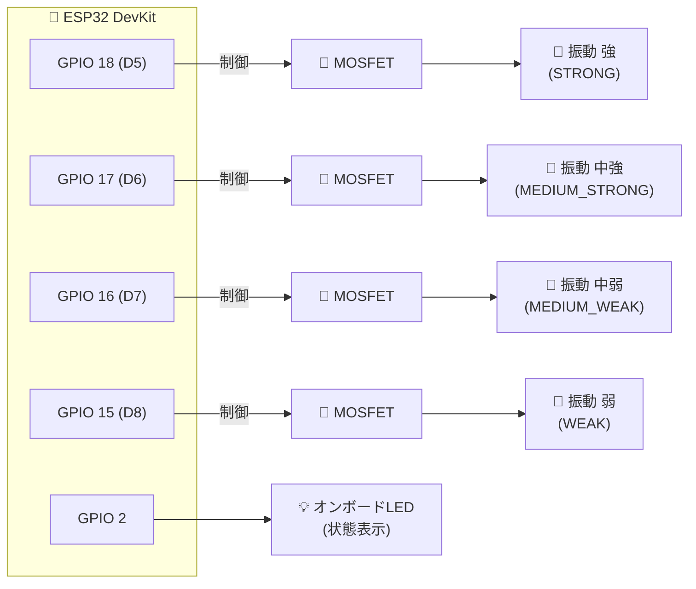
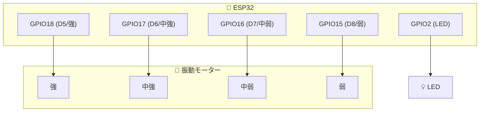
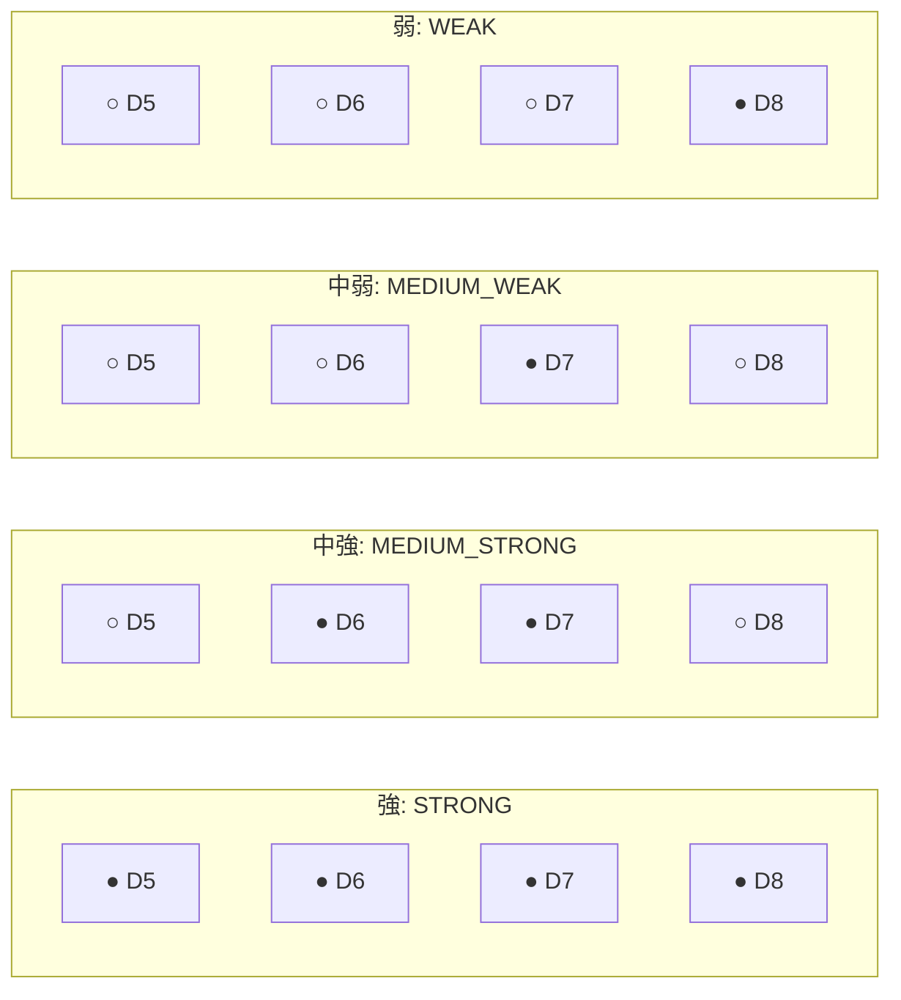

# 4D@HOME Android 詳細仕様書 - ESP32 ActionDrive ファームウェア仕様

**バージョン**: 1.0.0  
**作成日**: 2025年1月30日  
**対象**: ActionDrive Motor 1/2 (4D_AD1_XXXX / 4D_AD2_XXXX)

---

## 📑 目次

1. [概要](#1-概要)
2. [ハードウェア構成](#2-ハードウェア構成)
3. [ピン定義](#3-ピン定義)
4. [BLE設定](#4-ble設定)
5. [コマンド処理](#5-コマンド処理)
6. [振動モード](#6-振動モード)
7. [パターン再生](#7-パターン再生)
8. [ステータス通知](#8-ステータス通知)
9. [ビルド設定](#9-ビルド設定)
10. [Motor1/Motor2の違い](#10-motor1motor2の違い)

---

## 1. 概要

### 1.1 ActionDriveとは

ActionDriveは、振動モーターを制御するESP32ベースのデバイスです。4ピン構成のモーターを独立制御し、多彩な振動パターンを実現します。

### 1.2 システム構成

| 名称 | デバイス名パターン | 用途 |
|------|-------------------|------|
| ActionDrive Motor 1 | 4D_AD1_XXXX | メイン振動モーター |
| ActionDrive Motor 2 | 4D_AD2_XXXX | サブ振動モーター |

### 1.3 振動強度

| 強度 | 名称 | ピン出力パターン |
|------|------|------------------|
| STRONG | 強 | D5+D6+D7+D8全てON |
| MEDIUM_STRONG | 中強 | D6+D7のON |
| MEDIUM_WEAK | 中弱 | D7のみON |
| WEAK | 弱 | D8のみON |
| OFF | 停止 | 全ピンOFF |

### 1.4 パターン振動

| パターン | 名称 | 説明 |
|----------|------|------|
| HEARTBEAT | 心拍 | ドッ..クン...のリズム |
| RUMBLE_FAST | 高速振動 | 150ms ON/100ms OFF |
| RUMBLE_SLOW | 低速振動 | 300ms ON/300ms OFF |

---

## 2. ハードウェア構成

### 2.1 使用マイコン

| 項目 | 仕様 |
|------|------|
| **マイコン** | ESP32 DevKit |
| **CPU** | Xtensa LX6 デュアルコア 240MHz |
| **RAM** | 520KB SRAM |
| **Flash** | 4MB |
| **Bluetooth** | BLE 4.2 |

### 2.2 モーター接続



### 2.3 回路構成



### 2.4 振動強度パターン



**凡例**: ● = ON, ○ = OFF

### 2.4 制御方式

| 項目 | 値 |
|------|-----|
| 制御方式 | デジタルON/OFF（PWM不使用） |
| LEDピン | GPIO 2（オンボード） |
| PWMチャンネル | 4 (PIN_4用) |
| PWM周波数 | 1000 Hz |
| PWM解像度 | 8ビット (0-255) |
| PWM値 (MEDIUM_STRONG) | 150/255 |

---

## 3. ピン定義

### 3.1 ピンアサイン

```cpp
// ピン定義（MQTT版と同一）
#define MOTOR_PIN_D5  18    // 振動 強 (STRONG)
#define MOTOR_PIN_D6  17    // 振動 中強 (MEDIUM_STRONG)
#define MOTOR_PIN_D7  16    // 振動 中弱 (MEDIUM_WEAK)
#define MOTOR_PIN_D8  15    // 振動 弱 (WEAK)
#define PIN_LED       2     // 状態表示LED (オンボード)
```

### 3.2 制御方式

PWMは使用せず、全てデジタルON/OFF制御です。

---

## 4. BLE設定

### 4.1 UUID定義

EffectStationと共通のUUIDを使用します。

```cpp
#define SERVICE_UUID        "4D580001-0000-1000-8000-00805F9B34FB"
#define COMMAND_CHAR_UUID   "4D580002-0000-1000-8000-00805F9B34FB"
#define STATUS_CHAR_UUID    "4D580003-0000-1000-8000-00805F9B34FB"
```

### 4.2 デバイス名生成

```cpp
// action_drive_motor1/main.cpp
#define DEVICE_PREFIX "4D_AD1_"

// action_drive_motor2/main.cpp  
#define DEVICE_PREFIX "4D_AD2_"

String getDeviceName() {
    uint8_t mac[6];
    esp_read_mac(mac, ESP_MAC_BT);
    char name[16];
    sprintf(name, "%s%02X%02X", DEVICE_PREFIX, mac[4], mac[5]);
    return String(name);
}
```

### 4.3 BLE初期化

```cpp
void setup() {
    Serial.begin(115200);
    
    // ピン初期化
    pinMode(PIN_1, OUTPUT);
    pinMode(PIN_2, OUTPUT);
    pinMode(PIN_3, OUTPUT);
    pinMode(PIN_4, OUTPUT);
    
    // PWM設定
    ledcSetup(PWM_CHANNEL, PWM_FREQ, PWM_RES);
    ledcAttachPin(PIN_4, PWM_CHANNEL);
    
    // 初期状態: OFF
    allPinsOff();
    
    // BLE初期化
    String deviceName = getDeviceName();
    BLEDevice::init(deviceName.c_str());
    
    pServer = BLEDevice::createServer();
    pServer->setCallbacks(new ServerCallbacks());
    
    BLEService* pService = pServer->createService(SERVICE_UUID);
    
    pCommandChar = pService->createCharacteristic(
        COMMAND_CHAR_UUID,
        BLECharacteristic::PROPERTY_WRITE
    );
    pCommandChar->setCallbacks(new CommandCallbacks());
    
    pStatusChar = pService->createCharacteristic(
        STATUS_CHAR_UUID,
        BLECharacteristic::PROPERTY_READ | BLECharacteristic::PROPERTY_NOTIFY
    );
    pStatusChar->addDescriptor(new BLE2902());
    
    pService->start();
    
    BLEAdvertising* pAdvertising = BLEDevice::getAdvertising();
    pAdvertising->addServiceUUID(SERVICE_UUID);
    pAdvertising->start();
}
```

---

## 5. コマンド処理

### 5.1 コマンドコールバック

```cpp
class CommandCallbacks : public BLECharacteristicCallbacks {
    void onWrite(BLECharacteristic* pCharacteristic) {
        std::string stdValue = pCharacteristic->getValue();
        String value = String(stdValue.c_str());
        if (value.length() > 0) {
            processStringCommand(value);
        }
    }
};
```

### 5.2 コマンドパース

```cpp
void processStringCommand(const String& cmd) {
    int firstComma = cmd.indexOf(',');
    String cmdType = (firstComma > 0) ? cmd.substring(0, firstComma) : cmd;
    cmdType.trim();
    cmdType.toUpperCase();
    
    if (cmdType == "MOTOR") {
        String modeStr = cmd.substring(firstComma + 1);
        modeStr.trim();
        modeStr.toUpperCase();
        
        if (modeStr == "STRONG") {
            setMotorStrong();
        }
        else if (modeStr == "MEDIUM_STRONG") {
            setMotorMediumStrong();
        }
        else if (modeStr == "MEDIUM_WEAK") {
            setMotorMediumWeak();
        }
        else if (modeStr == "WEAK") {
            setMotorWeak();
        }
        else if (modeStr == "OFF" || modeStr == "0") {
            setMotorOff();
        }
        else {
            // パターンコマンド
            if (modeStr == "PATTERN_RUMBLE") {
                startPattern(PATTERN_RUMBLE);
            }
            else if (modeStr == "PATTERN_PULSE") {
                startPattern(PATTERN_PULSE);
            }
            else if (modeStr == "PATTERN_WAVE") {
                startPattern(PATTERN_WAVE);
            }
        }
    }
    else if (cmdType == "OFF" || cmdType == "ALL_OFF") {
        setMotorOff();
    }
    
    sendStatus();
}
```

### 5.3 コマンド一覧

| コマンド | 形式 | 説明 |
|---------|------|------|
| MOTOR,STRONG | `MOTOR,STRONG` | 最大振動（全ピンON） |
| MOTOR,MEDIUM_STRONG | `MOTOR,MEDIUM_STRONG` | 中強振動（D6+D7） |
| MOTOR,MEDIUM_WEAK | `MOTOR,MEDIUM_WEAK` | 中弱振動（D7のみ） |
| MOTOR,WEAK | `MOTOR,WEAK` | 弱振動（D8のみ） |
| MOTOR,OFF | `MOTOR,OFF` | 停止 |
| MOTOR,HEARTBEAT | `MOTOR,HEARTBEAT` | 心拍パターン |
| MOTOR,RUMBLE_FAST | `MOTOR,RUMBLE_FAST` | 高速振動パターン |
| MOTOR,RUMBLE_SLOW | `MOTOR,RUMBLE_SLOW` | 低速振動パターン |
| OFF | `OFF` | 全停止 |
| STOP | `STOP` | 全停止 |

**互換性のため、以下のコマンドタイプも受け付けます**:
- `VIB` - `MOTOR`と同等
- `VIBRATION` - `MOTOR`と同等

---

## 6. 振動モード

### 6.1 モード定義

```cpp
enum MotorMode {
    MOTOR_OFF,
    MOTOR_WEAK,
    MOTOR_MEDIUM_WEAK,
    MOTOR_MEDIUM_STRONG,
    MOTOR_STRONG,
    MOTOR_HEARTBEAT,
    MOTOR_RUMBLE_FAST,
    MOTOR_RUMBLE_SLOW
};

MotorMode currentMotorMode = MOTOR_OFF;
```

### 6.2 STRONG (強)

```cpp
case MOTOR_STRONG:
    // 「振動強は全部のモーターを回す」
    digitalWrite(MOTOR_PIN_D5, HIGH);
    digitalWrite(MOTOR_PIN_D6, HIGH);
    digitalWrite(MOTOR_PIN_D7, HIGH);
    digitalWrite(MOTOR_PIN_D8, HIGH);
    break;
```

### 6.3 MEDIUM_STRONG (中強)

```cpp
case MOTOR_MEDIUM_STRONG:
    // 「振動中強はD6とD7のモーターを動かす」
    digitalWrite(MOTOR_PIN_D5, LOW);
    digitalWrite(MOTOR_PIN_D6, HIGH);
    digitalWrite(MOTOR_PIN_D7, HIGH);
    digitalWrite(MOTOR_PIN_D8, LOW);
    break;
```

### 6.4 MEDIUM_WEAK (中弱)

```cpp
case MOTOR_MEDIUM_WEAK:
    // 「振動中弱はD7のモーターを動かす」
    digitalWrite(MOTOR_PIN_D5, LOW);
    digitalWrite(MOTOR_PIN_D6, LOW);
    digitalWrite(MOTOR_PIN_D7, HIGH);
    digitalWrite(MOTOR_PIN_D8, LOW);
    break;
```

### 6.5 WEAK (弱)

```cpp
case MOTOR_WEAK:
    // 「振動弱はD8のモーターを動かす」
    digitalWrite(MOTOR_PIN_D5, LOW);
    digitalWrite(MOTOR_PIN_D6, LOW);
    digitalWrite(MOTOR_PIN_D7, LOW);
    digitalWrite(MOTOR_PIN_D8, HIGH);
    break;
```

### 6.6 OFF (停止)

```cpp
case MOTOR_OFF:
    digitalWrite(MOTOR_PIN_D5, LOW);
    digitalWrite(MOTOR_PIN_D6, LOW);
    digitalWrite(MOTOR_PIN_D7, LOW);
    digitalWrite(MOTOR_PIN_D8, LOW);
    break;
```

---

## 7. パターン再生

### 7.1 パターン定義

ノンブロッキング実装で、1ループで他の処理をブロックしません。

```cpp
// ノンブロッキング制御用タイマー
unsigned long lastPatternTime = 0;
int patternStep = 0;
```

### 7.2 HEARTBEAT（心拍）パターン

「ドッ..クン...」のリズムをノンブロッキングで実現します。

```cpp
case MOTOR_HEARTBEAT:
    // 心拍 (ドッ..クン.......ドッ..クン...)
    // ドッ = 中弱 (D7), クン = 強 (D5)
    // ステップ0: (1.5秒待機) ドッ (中弱 D7)
    if (patternStep == 0 && (now - lastPatternTime > 1500)) { 
        setAllMotors(LOW);
        digitalWrite(MOTOR_PIN_D7, HIGH);
        lastPatternTime = now;
        patternStep = 1;
    }
    // ステップ1: (200ms) OFF
    else if (patternStep == 1 && (now - lastPatternTime > 200)) { 
        setAllMotors(LOW);
        lastPatternTime = now;
        patternStep = 2;
    }
    // ステップ2: (100ms) クン (強 D5)
    else if (patternStep == 2 && (now - lastPatternTime > 100)) { 
        digitalWrite(MOTOR_PIN_D5, HIGH);
        lastPatternTime = now;
        patternStep = 3;
    }
    // ステップ3: (150ms) OFF
    else if (patternStep == 3 && (now - lastPatternTime > 150)) { 
        setAllMotors(LOW);
        lastPatternTime = now;
        patternStep = 0; // ループ
    }
    break;
```

### 7.3 RUMBLE_FAST（高速振動）パターン

```cpp
case MOTOR_RUMBLE_FAST:
    // ドンドンドン (速)
    // ステップ0: (0.15秒待機) ドン (全モーター)
    if (patternStep == 0 && (now - lastPatternTime > 150)) {
        setAllMotors(HIGH);
        lastPatternTime = now;
        patternStep = 1;
    }
    // ステップ1: (100ms) OFF
    else if (patternStep == 1 && (now - lastPatternTime > 100)) {
        setAllMotors(LOW);
        lastPatternTime = now;
        patternStep = 0; // ループ
    }
    break;
```

### 7.4 RUMBLE_SLOW（低速振動）パターン

```cpp
case MOTOR_RUMBLE_SLOW:
    // ドン...ドン... (遅)
    // ステップ0: (0.3秒待機) ドン (全モーター)
    if (patternStep == 0 && (now - lastPatternTime > 300)) {
        setAllMotors(HIGH);
        lastPatternTime = now;
        patternStep = 1;
    }
    // ステップ1: (300ms) OFF
    else if (patternStep == 1 && (now - lastPatternTime > 300)) {
        setAllMotors(LOW);
        lastPatternTime = now;
        patternStep = 0; // ループ
    }
    break;
```

---

## 8. ステータス通知

### 8.1 ステータス送信

```cpp
void sendStatus() {
    if (deviceConnected && pStatusChar != nullptr) {
        uint8_t status[4] = {
            0x01,  // Motor1識別子 (Motor2の場合は0x02)
            (uint8_t)currentMotorMode,
            (uint8_t)(patternStep > 0 ? 1 : 0),
            0x00
        };
        pStatusChar->setValue(status, 4);
        pStatusChar->notify();
    }
}
```

### 8.2 ステータスバイト形式

| バイト | 内容 | 値 |
|--------|------|-----|
| [0] | デバイス識別子 | 0x01=Motor1, 0x02=Motor2 |
| [1] | モード | 0=OFF, 1=WEAK, 2=MEDIUM_WEAK, 3=MEDIUM_STRONG, 4=STRONG, 5=HEARTBEAT, 6=RUMBLE_FAST, 7=RUMBLE_SLOW |
| [2] | パターン実行中 | 0=なし, 1=実行中 |
| [3] | 予約 | 0x00 |

---

## 9. ビルド設定

### 9.1 platformio.ini

```ini
[env:esp32dev]
platform = espressif32
board = esp32dev
framework = arduino
monitor_speed = 115200

; lib_deps は現在空 (BLEは標準ライブラリ)
```

### 9.2 ディレクトリ構造

```
esp32/
├── action_drive_motor1/
│   ├── platformio.ini
│   └── src/
│       └── main.cpp
└── action_drive_motor2/
    ├── platformio.ini
    └── src/
        └── main.cpp
```

### 9.3 ビルドコマンド

```bash
# Motor1をビルド
cd esp32/action_drive_motor1
pio run

# Motor2をビルド
cd esp32/action_drive_motor2
pio run

# 書き込み
pio run --target upload

# シリアルモニター
pio device monitor --baud 115200
```

---

## 10. Motor1/Motor2の違い

### 10.1 コードの違い

Motor1とMotor2のソースコードは**ほぼ同一**です。唯一の違いは**デバイス名のプレフィックス**のみです。

| 項目 | Motor1 | Motor2 |
|------|--------|--------|
| ファイル | action_drive_motor1/src/main.cpp | action_drive_motor2/src/main.cpp |
| プレフィックス | `4D_AD1_` | `4D_AD2_` |
| 例 | `4D_AD1_A1B2` | `4D_AD2_C3D4` |

### 10.2 なぜ2つあるか

映画館の4DX/MX4Dシステムでは、複数の振動源を独立制御することで、より複雑な体感を実現します。

| 構成 | 用途例 |
|------|--------|
| 1台構成 | シンプルな振動 |
| 2台構成 | 左右独立振動、前後振動 |

### 10.3 Androidアプリでの識別

```kotlin
// BleConstants.kt
const val DEVICE_PREFIX_ACTION_DRIVE_1 = "4D_AD1_"
const val DEVICE_PREFIX_ACTION_DRIVE_2 = "4D_AD2_"

// DeviceType.kt
enum class DeviceType {
    EFFECT_STATION,
    ACTION_DRIVE_1,
    ACTION_DRIVE_2
}
```

### 10.4 タイムラインでの指定

```json
{
    "actions": [
        {
            "action": "VIBRATION",
            "target": "MOTOR1",
            "mode": "STRONG"
        },
        {
            "action": "VIBRATION",
            "target": "MOTOR2",
            "mode": "WEAK"
        }
    ]
}
```

---

## 付録: 完全なモード対応表

### Android → ESP32 コマンドマッピング

| VibrationMode (Kotlin) | esp32Command | 説明 |
|------------------------|--------------|------|
| OFF | MOTOR,OFF | 停止 |
| WEAK | MOTOR,WEAK | 弱振動 (D8のみ) |
| MEDIUM_WEAK | MOTOR,MEDIUM_WEAK | 中弱振動 (D7のみ) |
| MEDIUM_STRONG | MOTOR,MEDIUM_STRONG | 中強振動 (D6+D7) |
| STRONG | MOTOR,STRONG | 強振動 (全ピン) |
| HEARTBEAT | MOTOR,HEARTBEAT | 心拍パターン |
| RUMBLE_FAST | MOTOR,RUMBLE_FAST | 高速振動 |
| RUMBLE_SLOW | MOTOR,RUMBLE_SLOW | 低速振動 |

### モードごとのピン出力

| モード | D5 (GPIO18) | D6 (GPIO17) | D7 (GPIO16) | D8 (GPIO15) |
|--------|-------------|-------------|-------------|-------------|
| OFF | LOW | LOW | LOW | LOW |
| WEAK | LOW | LOW | LOW | HIGH |
| MEDIUM_WEAK | LOW | LOW | HIGH | LOW |
| MEDIUM_STRONG | LOW | HIGH | HIGH | LOW |
| STRONG | HIGH | HIGH | HIGH | HIGH |
